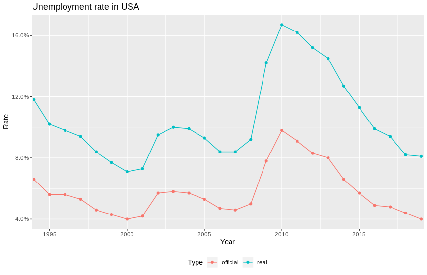

#### Poprawiany wykres:



#### Moje zmiany:

* nie ucinanie osi Y
* zmiana geometrii
* każy rok otrzymał swoją etykietę na osi X
* użycie innej kolorystyki
* zwiększenie czcionki

```{r setup, message = FALSE, warning = FALSE}
library(ggplot2)
library(dplyr)
library(ggthemes)

official <- c(6.6, 5.6, 5.6, 5.3, 4.6, 4.3, 4.0, 4.2, 5.7, 5.8,
        5.7, 5.3, 4.7, 4.6, 5.0, 7.8, 9.8, 9.1, 8.3, 8.0,
        6.6, 5.7, 4.9, 4.8, 4.4, 4.0) / 100
real <- c(11.8, 10.2, 9.8, 9.4, 8.4, 7.7, 7.1, 7.3, 9.5, 10.0,
          9.9, 9.3, 8.4, 8.4, 9.2, 14.2, 16.7, 16.2, 15.2, 14.5,
          12.7, 11.3, 9.9, 9.4, 8.2, 8.1) /100

unemployment <- data.frame(
  Year = c(c(1994:2019), c(1994:2019)),
  Rate = c(official, real),
  Type = as.factor(c(rep(times = 26, "official"), rep(times = 26, "real")))
)
```
```{r out.width="100%", warning=FALSE}
ggplot(data = unemployment, aes(x = as.factor(Year) , y = Rate, fill = Type)) +
   geom_bar(stat = "identity", position = position_dodge(width = 0), width = 1.3) +
   scale_y_continuous(labels = scales::percent, expand = expand_scale(add = c(0, 0)), limits = c(0, 0.2)) +
   scale_fill_brewer(palette="Paired") +
   theme_gray() + 
   labs(title = "Unemployment rate in USA 1994-2019", x = "Year", y = "Rate", caption = 
           "Source: https://www.thebalance.com/what-is-the-real-unemployment-rate-3306198") +
   theme(axis.text.x = element_text(angle = 90, vjust = 0.4), 
         panel.grid.minor.y = element_line(colour = "white"), legend.position = "bottom", text = element_text(size=12))
```
