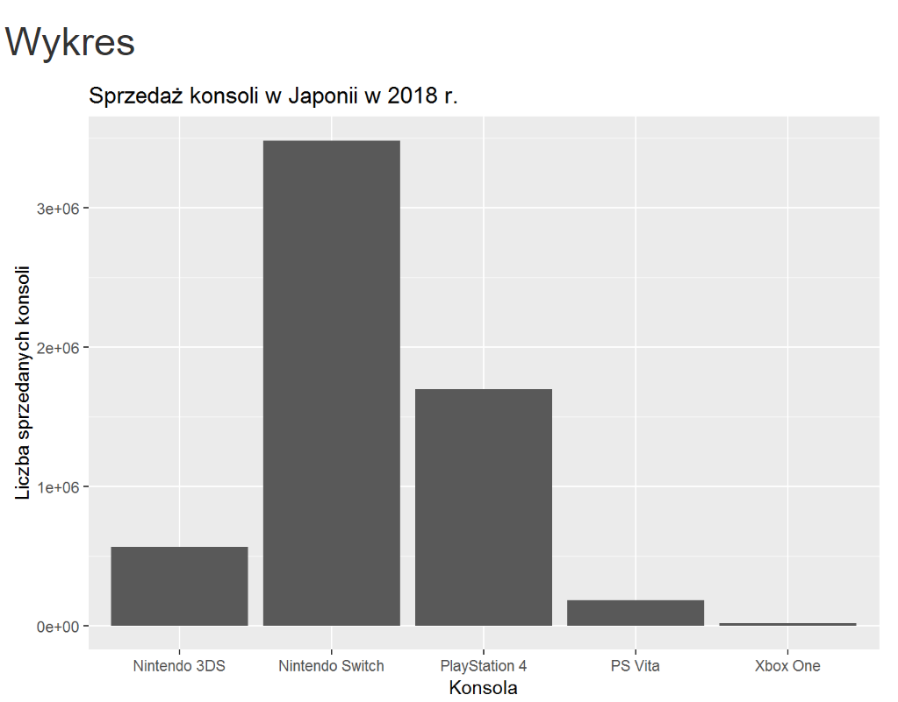

## Wykres oryginalny


## Opis zmian
Na wykresie zmieniono:

* Konsole zosta³y uporz¹dkowane w kolejnoœci malej¹cej, dziêki czemu mo¿na ³atwo porównaæ wyniki sprzeda¿y.
* Wartoœci wyników sprzeda¿y zosta³y przedstawione w milionach sztuk, dziêki czemu nie zostaj¹ wyœwietlone w notacji naukowej i s¹ czytelniejsze.
* S³upki zosta³y opisane wartoœciami liczby sprzedanych sztuk w milionach, co daje dodatkow¹ informacjê o dok³adnych wynikach sprzeda¿y.
* W artykule zosta³a podana informacja o producencie ka¿dej z konsol. Zamieszczenie jej na wykresie i pokolorowanie s³upków wed³ug ich producentów dodaje informacjê i porz¹dkuje dane.

## Kod
```{r message=FALSE, warning=FALSE, error=FALSE}
library(dplyr)
library(ggplot2)

console <- c("Nintendo Switch", "PlayStation 4", "Nintendo 3DS", "PS Vita", "Xbox One")
manufacturer <- c("Nintendo", "Sony Interactive Entertainment", "Nintendo", 
                  "Sony Interactive Entertainment", "Microsoft")
consoles_sold <- c(3482388, 1695227, 566420, 181728, 15339)
df<- data.frame(console, manufacturer, consoles_sold) %>% 
  mutate(consoles_sold_mln = consoles_sold / 1000000)  
  
plot <- ggplot(df, aes(x=reorder(console, -consoles_sold), y=consoles_sold_mln, fill=manufacturer)) + 
  geom_bar(stat="identity") + 
  geom_text(aes(label = consoles_sold_mln), vjust = -0.3) +
  ggtitle("Sprzeda¿ konsoli w Japonii w 2018 r.") +
  labs(y="Liczba sprzedanych konsoli (mln)", x = "Konsola") + 
  guides(fill=guide_legend(title="Producent"))
```

## Wykres poprawiony
```{r message=FALSE, warning=FALSE, error=FALSE}
plot
```