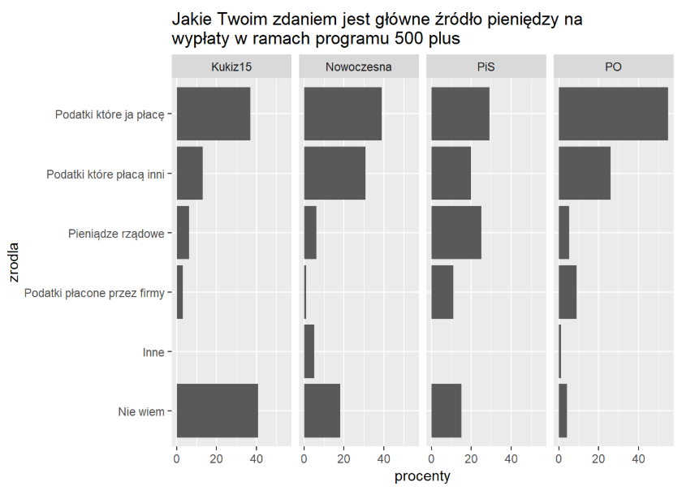

```{R setup, include=FALSE}
knitr::opts_chunk$set(echo = TRUE)
library(ggplot2)
library(dplyr)
```


## Dane

```{R, warning = FALSE}
procenty <- c(29, 20, 25, 11, 0, 15, 37, 13, 6, 3, 0, 41, 55, 26, 5, 9, 1, 4, 39, 31, 6, 1, 5, 18)

zrodla <- c("Podatki które ja płacę", "Podatki które płacą inni", "Pieniądze rządowe", 
            "Podatki płacone przez firmy", "Inne", "Nie wiem")

partie <- c("PiS", "Kukiz15", "PO", "Nowoczesna")

df <- tibble(procenty = procenty, zrodla = factor(rep(zrodla, 4), levels = zrodla),
             partie = rep(partie, each = 6))
```


## Wykres bazowy



## Wykres poprawiony

Co zostało poprawione:

* zestawienie czterech wykresów na jednym
* pokolorowanie słupków w zależności od partii
* stworzenie legendy i odpowiednie jej podpisanie
* poprawienie podpisów osi

Uważam, że przedstawienie tych danych na jednym wykresie jest lepsze, ponieważ umożliwia porównywanie wyników ankiety pomiędzy sympatykami danych patrii, a nie tylko wewnątrz tych grup. Ponadto wyniki dla każdej z partii zostały przedstawione innym kolorem, co ułatwia ich porównywanie. Natomiast poprawione podpisy osi dają lepszy pogląd na to czego właściwie dotyczyła ankieta. 

```{R, warning = FALSE, fig.width = 10, fig.height = 6}
ggplot(data = df, aes(x = zrodla, y = procenty, fill = partie)) + 
  geom_bar(stat = 'identity', position = "dodge") +
  coord_flip() +
  ylim(0, 60) +
  scale_x_discrete(limits = rev(levels(df$zrodla))) +
  ggtitle("Jakie Twoim zdaniem jest główne źródło pieniędzy\nna wypłaty w ramach programu 500+") + 
  xlab("Źródła pieniędzy") + ylab("% osób ankietowanych") +
  guides(fill=guide_legend(title = "Sympatycy danej\npartii politycznej")) +
  theme(plot.title = element_text(size = 15, face = "bold"),
        axis.text = element_text(size = 13),
        axis.title = element_text(size = 14, face = "bold"),
        legend.title = element_text(size = 14, face = "bold"),
        legend.text = element_text(size = 13))
```

