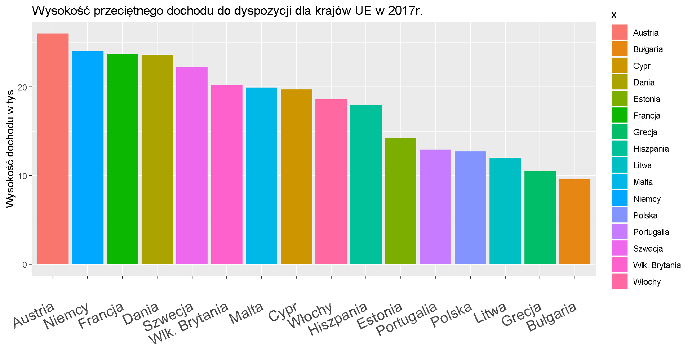

```{r, include=FALSE}
knitr::opts_chunk$set(echo = TRUE, warning = FALSE, error = FALSE, message = FALSE)
```

## Przedmiot zmiany
Wykres, który został poprawiony:
```{r, echo=FALSE}

```
autorstwa Aleksandry Miesiąc. 

Źródło: https://github.com/mini-pw/WizualizacjaDanych2018/blob/master/PraceDomowe/PD1/gr1/Aleksandra%20Miesi%C4%85c/PrDom1.html

## Kod dla poprawionego wykresu

```{r}
library(ggplot2)
library(dplyr)

# Utworzenie wektorów z danymi, na podstawie których rysowany będzie wykres
x <- c("Estonia","Malta","Austria","Polska","Dania","Litwa","Bułgaria","Szwecja","Niemcy","Francja",
       "Włochy","Portugalia","Hiszpania","Cypr","Wlk. Brytania","Grecja")
y <- as.numeric(c(14.2,19.9,26,12.7,23.6,12,9.6,22.2,24.0,23.7,18.6,12.9,17.9,19.7,20.2,10.5))

# Zebranie danych w data frame
dane <- data.frame(x, y)

# Rysowanie wykresu
orders <- dane %>%
  arrange(y) %>%
  pull(x)
  
myplot <- ggplot(dane, aes(x=x)) + 
  geom_bar(aes(weight = y)) + 
  coord_flip() +
  scale_x_discrete(limits = orders) + 
  ggtitle("Wysokość przeciętnego dochodu do dyspozycji dla krajów UE w 2017r.") + 
  labs(y="Wysokość dochodu w tyś.", x=' ') + 
  theme(axis.text.x=element_text(vjust=0.5,size = 10)) +
  scale_y_continuous(breaks=seq(0, 30, 5))
```

## Poprawiony wykres
```{r, echo=FALSE}
myplot
```

## Co zostało poprawione?
* Zamieniono miejscami koordynaty x i y,
* pozbyto się innego koloru słupka dla każdego z państwa.