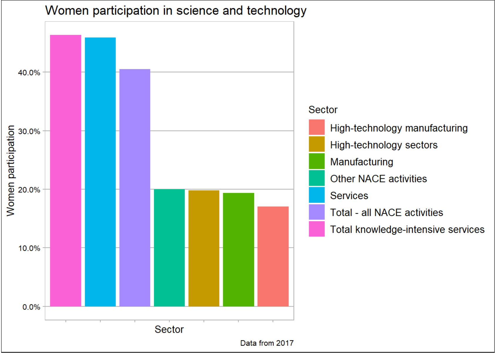

```{r setup, include=FALSE}
knitr::opts_chunk$set(echo = TRUE)
library(dplyr)
library(tidyr)
library(ggplot2)
library(ggthemes)
library(magrittr)
```

## Dane

```{r dane}
data <- read.csv("hrst_st_nsecsex2_1_Data.csv", sep=',') %>% as_tibble()
data %<>% mutate(Value = as.numeric(sub(",", "", as.character(Value)  )))

data %<>% spread(., SEX, Value)
data %<>% mutate(males_percentage = Males/Total, 
                 females_percentage = Females/Total)
data %<>% mutate(Sector=as.character(NACE_R2))
data[data$Sector == "High-technology sectors (high-technology manufacturing and knowledge-intensive high-technology services)", "Sector"] = "High-technology sectors"
```


## Stary wykres



## Poprawiony wykres
Uważam, że największym problemem poprzedniego wykresu było pokazanie sektoru za pomocą koloru. Przez to nie było od razu widoczne w jakich sektorach jest ile procent kobiet i trzeba było posiłkować się legendą. 

W mojej wersji:  
  1) Zamieniono oś X z osią Y.  
  2) Usunięto legendę.  
  3) Skrócono nazwę najdłuższego sektoru by nazwy sektoru można było umieścić na wykresie.   
  4) Zmieniono temat na domyślny temat ggplota.  

Zmiany te pozwoliły na łatwiejsze porównywanie ze sobą poszczególnych sektorów i zobaczenie jak plasują się w stosunku do innych.
```{r wykres_nowy}
sector_order <- group_by(data, Sector) %>% 
  summarise(females_percentage) %>% 
  arrange(females_percentage)%>% 
  pull(Sector)
ggplot(data = data, aes(x=Sector, y = females_percentage, fill=Sector)) + 
  geom_bar(stat = "identity") + theme(legend.position = "none") + 
  scale_x_discrete(limits = sector_order) + coord_flip() + 
    scale_y_continuous(labels = scales::percent) +   ylab("Women participation") +   labs(title = 'Women participation in science and technology', caption = "Data from 2017")
```


