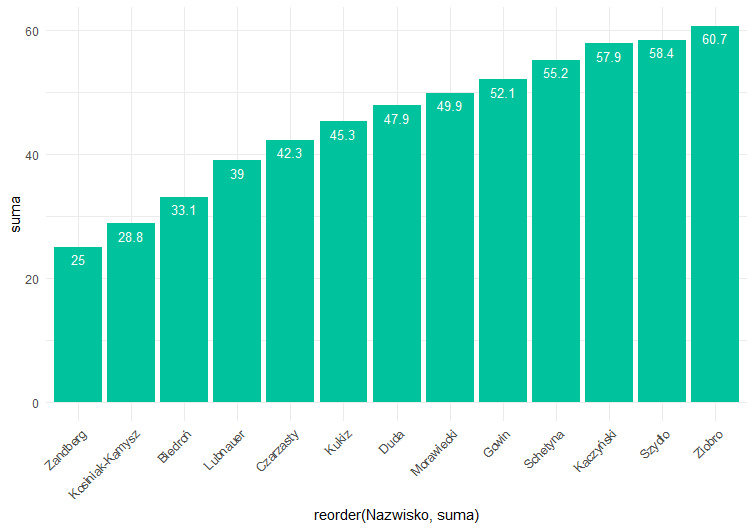

```{r setup, include=FALSE}
knitr::opts_chunk$set(echo = TRUE, warning = FALSE, message=FALSE, fig.width=10)
library(dplyr)
library(tidyr)
library(ggplot2)
```

##Obrazek bazowy


## Przygotowanie danych

```{r data}
data <- data.frame(
  "Nazwisko" = c("Biedroń","Kosiniak-Kamysz",
                 "Lubnauer", "Kukiz", "Duda",
                 "Morawiecki","Kaczyński","Szydło",
                 "Ziobro", "Schetyna","Gowin", 
                 "Zandberg","Czarzasty"), 
  "Zdecydowanie nie ufam" = c(19.1,12.8,28.1,27.1,37.0,37.8,52.3,46.5,49.3,36.8,34.4,13.6,23.2), 
  "Raczej nie ufam" = c(14.0,16.0,10.9,18.2,10.9,12.1,5.6,11.9,11.4,18.4,17.7,11.4,19.1))


prep.data <- data.frame(data,"suma"=rowSums(data[2:3]))


data.narrow <- gather(prep.data, "Odpowiedz", "Procent.ankietowanych", Zdecydowanie.nie.ufam, Raczej.nie.ufam)
data.narrow <- data.narrow %>% 
  mutate(label_text = ifelse(Odpowiedz == "Raczej.nie.ufam", suma, 0))

```

## Poprawiony wykres

Poprawione elementy:

* Podpisy osi
* Słupki pokazują sumę głosów oddanych na "Zdecydowanie nie ufa" i "Raczej nie ufam" można je rozróżnić kolorem wypełnienia bez utraty spójności wykresu
* Dodanie legendy
* Zmiana koloru


```{r plot}


ggplot(data = data.narrow, aes(x = reorder(Nazwisko,suma), fill = Odpowiedz, y=Procent.ankietowanych)) + 
  geom_bar(stat="identity", position="stack") + 
  geom_text(aes(label=Procent.ankietowanych), position=position_stack(vjust=0.5), color="white", size=3.5) +
  geom_text(aes(label=ifelse(label_text == 0,"", label_text), y=label_text+1), 
            position=position_stack(vjust=1), color="black", size=3.5,
            fontface="bold") +
  theme_classic() +
  theme(axis.text.x=element_text(angle=45,hjust=1)) +
  xlab("Nazwisko polityka") +
  ylab("Procent ankietowanych") +
  labs(fill = "Odpowiedź") +
  ggtitle("Ranking polityków o najniższym zaufaniu negatywnym")


```

## Uzasadnienie

Wypełnieni słupków oddzielnym kolorem dla różnych głosów daje nową informację o tym jaką część 
stanowiły osoby które stanowczo nie ufały danemu politykowi oraz te, które raczej mu nie ufały.


