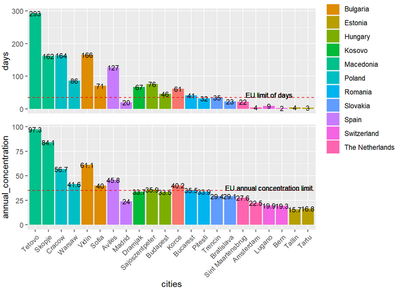

```{r setup, include=FALSE}
knitr::opts_chunk$set(echo = TRUE)
library(dplyr)
library(ggplot2)
library(gridExtra)
library(grid)
```

## Original plot
Author: Zuzanna Magierska
```{r}

```

## Load data

```{r}
countries <- c('Estonia', 'The Netherlands', 'Estonia', 'Romania',
               'The Netherlands', 'Poland', 'Slovakia',
               'Spain', 'Slovakia', 'Poland', 'Hungary',
               'Switzerland', 'Hungary', 'Romania', 'Switzerland', 
               'Bulgaria', 'Spain', 'Bulgaria', 'Kosovo',
               'Albania', 'Macedonia', 'Macedonia')

cities <- c('Tallin', 'Amsterdam', 'Tartu', 'Pitesti', 
            'Sint Maartensbrug', 'Warsaw', 'Trencin', 
            'Aviles', 'Bratislava', 'Cracow', 'Sajoszentpeter',
            'Bern', 'Budapest', 'Bucarest', 'Lugano', 
            'Vidin', 'Madrid', 'Sofia', 'Dramjak', 
            'Korce', 'Tetovo', 'Skopje')

days <- c(4, 4, 3, 32, 22, 86, 35, 127, 23, 164, 76, 2, 46,
          41, 9, 166, 20, 71, 67, 61, 293, 162)

annual_concentration <- c(15.7, 22.5, 16.8, 33.9, 27.6, 41.6,
                          29.4, 45.8, 29.1, 56.7, 35.9, 19.3,
                          33.5, 35.5, 19.9, 61.1, 24.0, 40.0,
                          33.7, 40.2, 97.3, 84.1)

smog_data <- data.frame(countries, cities, days, annual_concentration)

smog_data$cities <- paste(cities, " (", countries, ")", sep="")

cities_order_days <- smog_data %>%
  arrange(days) %>% 
  pull(cities)

cities_order_concentration <- smog_data %>%
  arrange(annual_concentration) %>% 
  pull(cities)

smog_data$cities_days_order <- factor(smog_data$cities, levels = cities_order_days)
smog_data$cities_concentration_order <- factor(smog_data$cities, levels = cities_order_concentration)

```


## New plots

```{r}
days_plot <- ggplot(data = smog_data, aes(x = cities_days_order, y = days, fill = countries)) + 
  scale_y_continuous(limits = c(0, 310)) + 
  geom_bar(stat = "identity") + 
  coord_flip() + 
  geom_text(aes(label = days), size=3, hjust = -0.3) +
  geom_abline(slope = 0, intercept = 35,  col = "red", lty = 2, alpha = 0.5) + 
  geom_text(x = 0, y = 35, label = "EU limit of days", hjust = -0.1, vjust = -1, size = 3, color = "red") + 
  theme(axis.ticks.x = element_blank(),
        axis.ticks.y = element_blank(),
        axis.title.y = element_blank(),
        axis.title.x = element_blank(),
        aspect.ratio = 1,
        panel.grid.major.y = element_blank(),
        panel.grid.minor = element_line(size = 0.3, colour = "#F0F0F0"),
        panel.grid.major = element_line(size = 0.3, colour = "#F0F0F0"),
        panel.background = element_blank(),
        plot.title = element_text(family = 'Helvetica', 
                                  color = 'black', 
                                  face = 'bold', 
                                  size = 16, 
                                  hjust = 0.5),
        plot.margin = unit(c(0,0,0.5,0), "cm")) + 
  scale_fill_brewer(palette = "Paired") + 
  labs(title=expression("Number of days exeeding concentration level above 50μg/"*m^3))


concentration_plot <- ggplot(data = smog_data, aes(x = cities_concentration_order, y = annual_concentration, fill = countries)) + 
  scale_y_continuous(limits = c(0, 103)) + 
  geom_bar(stat = "identity") + 
  coord_flip() + 
  geom_text(aes(label = annual_concentration), size=3, hjust = -0.3) +
  geom_abline(slope = 0, intercept = 35,  col = "red", lty = 2, alpha = 0.5) + 
  geom_text(x = 0, y = 35, label = "EU annual concentration limit", hjust = -0.1, vjust = -1, size = 3, color = "red", alpha = 0.5) + 
  theme(axis.ticks.x = element_blank(),
        axis.ticks.y = element_blank(),
        axis.title.y = element_blank(),
        axis.title.x = element_blank(),
        aspect.ratio = 1,
        panel.grid.major.y = element_blank(),
        panel.grid.minor = element_line(size = 0.3, colour = "#F0F0F0"),
        panel.grid.major = element_line(size = 0.3, colour = "#F0F0F0"),
        panel.background = element_blank(),
        plot.title = element_text(family = 'Helvetica', 
                                  color = 'black', 
                                  face = 'bold', 
                                  size = 16, 
                                  hjust = 0.5),
        plot.margin = unit(c(0,0,0.5,0), "cm")) + 
  scale_fill_brewer(palette = "Paired") + 
  labs(title=expression('PM'[10]~"annual concentration"))

get_legend<-function(a.gplot){
  tmp <- ggplot_gtable(ggplot_build(a.gplot))
  leg <- which(sapply(tmp$grobs, function(x) x$name) == "guide-box")
  legend <- tmp$grobs[[leg]]
  return(legend)}

legend<-get_legend(days_plot)

```

What I've changed:  
- added better plots descriptions, *days* and *annual_concentration* aren't very descriptive  
- changed colors pallete, with old colors it was hard to distinguish between some countries (eg. Romania and Slovakia)  
- flipped plots, it's easier to read city labels when they're placed horizontal  
- moved numeric labels a little bit upper (more aesthetic)  
- replaced grey grid (more professional look)  
- changed bars order (easier to rank specific city) 
- added countries to city labels  
```{r}
grid.arrange(arrangeGrob(days_plot + theme(legend.position = "None"), concentration_plot + theme(legend.position = "None"), nrow = 2), legend, nrow = 1, widths = c(10, 1.5))
```
