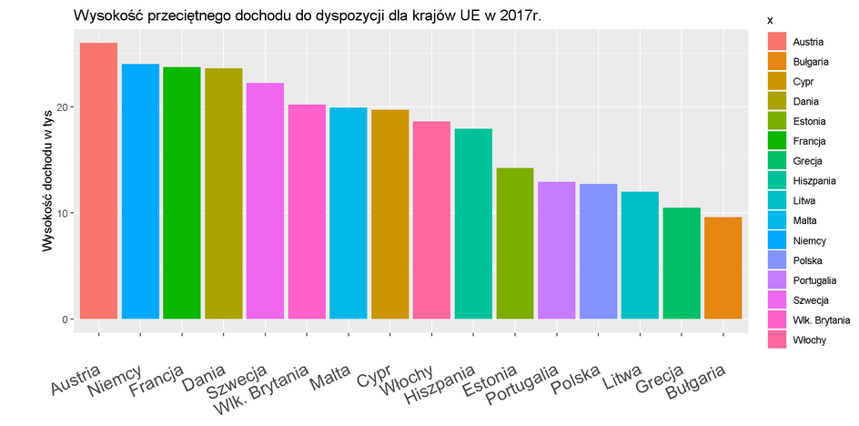

```{r setup, include=FALSE}
knitr::opts_chunk$set(echo = TRUE)
library(ggplot2)
library(dplyr)
```
# Cel zadania
Celem zadania była modyfikacja wybranego wykresu wykonanego (jako poprzednia praca domowa) przez kolegę/koleżankę.

# Wykres bazowy
Wykres, który będę modyfikować, przedstawia się następująco:



# Wykres zmodyfikowany
Wykonane zmiany w porównaniu do oryginalnego wykresu:

* zmiana kąta nachylenia etykiet na osi odciętych
* dodanie dokładnych wartości dochodu dla każdego słupka
* dodanie liczb do osi rzędnych
* usunięcie legendy (informacje o krajach zostały zawarte w etykietach)

```{r, echo=FALSE, fig.width=10}
x <- c("Estonia","Malta","Austria","Polska","Dania","Litwa","Bułgaria","Szwecja","Niemcy","Francja",
       "Włochy","Portugalia","Hiszpania","Cypr","Wlk. Brytania","Grecja")
y <- as.numeric(c(14.2,19.9,26,12.7,23.6,12,9.6,22.2,24.0,23.7,18.6,12.9,17.9,19.7,20.2,10.5))
dane<- data.frame(x,y)
orders <- dane %>%arrange(desc(y))%>%pull(x)
 (ggplot(dane, aes(x=x, y=y, fill=x))
  + geom_col()
  + scale_x_discrete(limits =orders)
  + geom_text(aes(label=formatC(dane$y, digits = 1, format = 'f')),
                colour ="White",
                fontface="bold", 
                size = 5,
                hjust = 1.2,
                vjust = 0.4,
                angle = 90)
  + ggtitle("Wysokość przeciętnego dochodu do dyspozycji dla krajów UE w 2017r.")
  + labs(y="Wysokość dochodu w tys", x=' ') 
  + scale_y_continuous(breaks = seq(0, 28, 3))
  + theme(axis.text.x=element_text(angle=90,hjust=1,vjust=0.5,size = 15),
          legend.position = "none"))
```