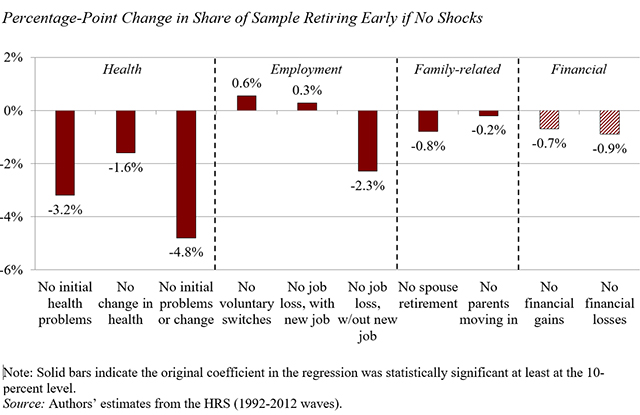
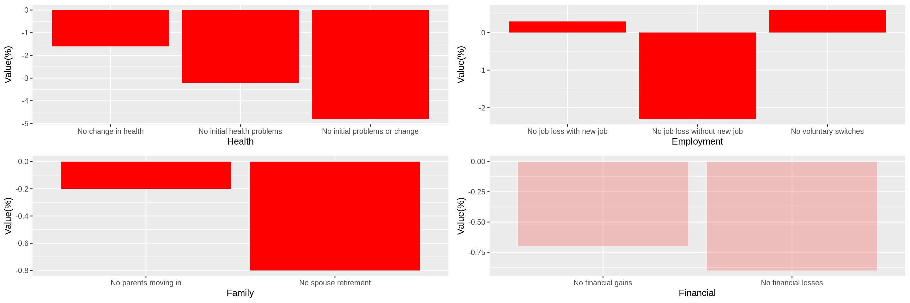

## First approach

The aim of this report was to recreate a plot from an article: "Why do 37% of older workers retire earlier than planned?" Let's see how the original visualization looks like.



It is a simple composition of 4 barplots. What about the recreated version?



At first sight the plots look completely different. The most important differences are:

* layout of the sub-plots
* size of the bars
* chosen colors
* background
* scale on the y axis

## Improvements 

Lets try to fix it. The data will be loaded in the same way.
```{r, tidy=TRUE, tidy.opts=list(width.cutoff=80), fig.width=15}
library('ggplot2')
library('stringr')

Health<-data.frame(
  reason=c('No initial health problems',  'No change in health', 'No initial problems or change'), 
  value=c(-3.2, -1.6, -4.8) 
)

Employment<-data.frame(
  'reason'=c('No voluntary switches','No job loss, with new job','No job loss, w/out new job'),
  'value'=c(0.6, 0.3, -2.3) 
)

Family_related<-data.frame(
  'reason'=c('No spouse retirement','No parents moving in'),
  'value'=c(-0.8,-0.2) 
)

Financial<-data.frame(
  'reason'=c('No financial gains','No financial losses'),
  'value'=c(-0.7,-0.9) 
)
```
Let's add column which will be used for faceting to each data frame and combine everything into a single one.
```{r}
Health <- cbind(Health, type = c('Health', 'Health', 'Health'))
Employment <- cbind(Employment, type = c('Employment', 'Employment', 'Employment'))
Family_related <- cbind(Family_related, type = c('Family-related', 'Family-related'))
Financial <- cbind(Financial, type = c('Financial', 'Financial'))

all_df <- rbind(Health, Employment, Family_related, Financial)
all_df$reason = factor(all_df$reason, levels = all_df$reason) 
```
Now, lets plot everything using geom_bar and facet_wrap.
```{r}
custom_fill <- c()
custom_fill[0:8] <- 'darkred'
custom_fill[9:10] <- 'firebrick1'
all_df = cbind(all_df, custom_fill)

ggplot(data = all_df, aes(x = reason, y = value, font)) +
    geom_bar(stat = 'identity', width = 0.4, color = 'black', fill = custom_fill) +
    geom_text(aes(y = value + 0.3 * sign(value), label = paste0(value, '%'))) +
    geom_vline(xintercept = 3.6, linetype = 'dashed') +
    scale_y_continuous(name = '', limits = c(-6, 2), labels = function(x) paste0(x, '%')) +
    scale_x_discrete(name = '', labels = function(x) str_wrap(x, width = 8)) +
    scale_fill_manual(values = c('darkred' = 'darkred', 'forestgreen' = 'orange')) +
    facet_wrap(~ type, nrow = 1, scales = 'free_x') +
    theme(
        text = element_text(family = 'serif', size = 12, face = 'bold'),
        panel.background = element_blank(),
        panel.grid.major.y = element_line(color = 'lightgray'),
        panel.grid.major.x = element_blank(),
        panel.spacing.x = unit(0, 'lines'),
        strip.background = element_blank(),
        strip.text = element_text(face = 'italic')
    )
```

Unfortunately, not everything is the same as in the original visualization, for instance:

* the 3rd line between facets is missing
* the style of bars for Financial section is different
