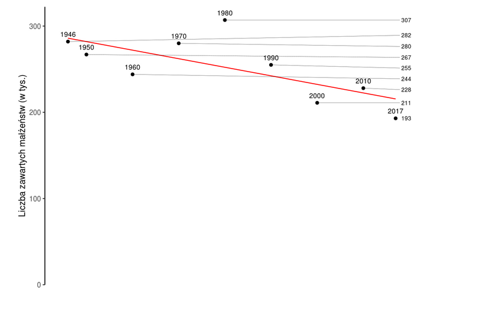

```{r setup, include=FALSE}
knitr::opts_chunk$set(echo = TRUE)
library(ggplot2)
library(dplyr)
```

## Oryginał (autor: Tymoteusz Makowski)


## Moja wersja

## load data
```{r}
liczba_malzenstw <- c(282, 267, 244, 280, 307, 255, 211, 228, 193)
lata <- c(1946, 1950, 1960, 1970, 1980, 1990, 2000, 2010, 2017)
df <- as.data.frame(cbind(lata, liczba_malzenstw))
```

## plot
```{r}
ggplot(df, aes(x = lata, y = liczba_malzenstw, label = liczba_malzenstw)) +
  geom_line(color = 'blue', alpha = 0.5) + 
  geom_text(size = 4, hjust = 1.5) + 
  geom_point(color = 'red') + 
  scale_x_continuous(breaks = lata, limits = c(1943, 2018), name = 'Lata') + 
  scale_y_continuous(limits = c(0,310), name = 'Liczba zawartych małżeństw (w tyś.)') + 
  ggtitle('Liczba zawartych małżeństw na przestrzeni lat') + 
  theme(plot.title = element_text(hjust = 0.5))
```