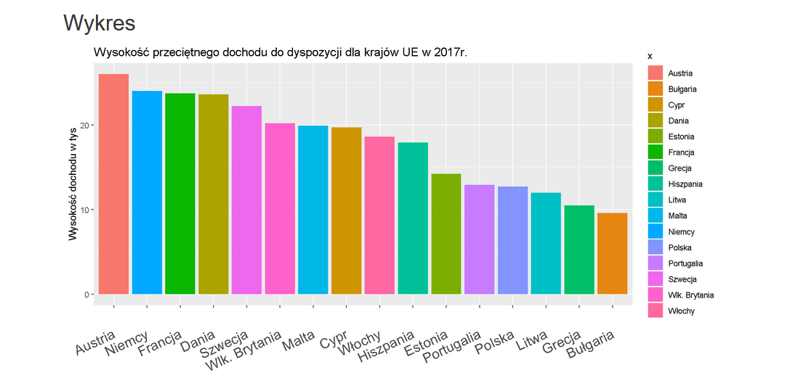

```{r setup, include=FALSE,warning=FALSE}
library(ggplot2)

x <- c("Estonia","Malta","Austria","Polska","Dania","Litwa","Bułgaria","Szwecja","Niemcy","Francja",
       "Włochy","Portugalia","Hiszpania","Cypr","Wlk. Brytania","Grecja")
y <- as.numeric(c(14.2,19.9,26,12.7,23.6,12,9.6,22.2,24.0,23.7,18.6,12.9,17.9,19.7,20.2,10.5))

df = data.frame(country=x,avg_income=y)
```

## Oryginalny wykres

Na warsztat został wzięty wykres z pierwszej pracy domowej autorstwa pani Miesiąc  
https://github.com/mini-pw/WizualizacjaDanych2018/commit/4bcad7d0e9b94198a43656792b92d819eb3acd51



Obstawiam, że wykres powyżej miał przedstawiać dochód dla przeciętnego mieszkańca prezentowanych krajów UE w roku 2017.

### Co jest mi się nie podoba?
#### Tytuł wykresu:  
* "Wysokosć przeciętnego dochodu do dyspozycja dla krajów UE w 2017", brzmi to trochę enigmatyczne, szczególnie, że prezentowane dochody są dla mieszkańca danego państwa, a nie 'dla kraju' (zweryfikowane z artykyułem)

#### Kolory słupków i legenda:  
* Oceniający (niestety) potrafi rozróżnić trzy podstawowe kolory (RGB) i bez podpisóW pod osią za pewne nie potrafiłby rozróżnić, który słupek odpowiada Szwecji, a który Wielkiej Brytanii. (zbliżone kolory słupków obok siebie na wykresie). Skoro jest taka sytuacja, to może warto zrezygnować z kolorów, które i tak duplikują informację przekazaną za pomocą podpisania osi X.  
* Inna kolejność występowania miast na wykresie, a inna kolejność w legendzie  
* Tytuł legendy mógłby być inny, ale w sumie sam się zastanawiam co bym tam wpisał, więc może lepiej jakby legendy nie było?  
* Kolory słupków w moim odczuciu sugerują jakieś powiązanie/klasyfikację, można odnieść wrażenie, że skoro kolory są do siebie zbliżone to może dane prezentowane zbliżonymi kolorami są w 'sąsiedztwie', szczególnie, że legenda wydaje się przechodzić przez 3 stopniowy gradient.  

#### Podpis osi X  
* Z powodu różnej szerokości nazw państw można czasem się pogubić, do którego słupka odnosi się konkretny podpis. Na przykładzie państwa Hiszpania, którego środek napisu jest pod słupkiem koloru ~różowego, a tak naprawdę słupek dla państwa Hiszpani, jest tam gdzie się kończy nazwa państwa (czyli pod ~zielonym), co może być lekko nieintuicyjne dla użytkownika.  
* Idąc od lewej strony łatwo zauważyć, że podpis, a raczej jego ostatnia litera wskazuje słupek. Jednak oceniającemu, który chciał zobaczyć na samym początku jak sie jego kraj plasuje, nie był w stanie powiedzieć, który z dwóch ~fioletowatych słupków jest dla Polski (musiał spojrzeć na legendę)

#### Tytuł osi y
* "Wysokość dochodu w tys". Tysiącach czego? Polskich złotówek, euro, może jednak dolary? Brak danej informacji nie wpływa na ranking, ale uniemożliwia wyciągnięcia danych jakościowych. Jednostką jak się okazało jest Parytet Siły Nabywczej, co jest dla oceniającego zaskoczeniem, bo przypuszczał, że dane są pokazane w euro, więc wydaje się, że warto byłoby gdzieś o tym wspomnieć. Poza tym słówko wysokość wydaje się być zbędne.

### Co mi się podoba?
* Słupki są przedstawione w kolejności malejącej. Łatwo sprawdzić, że Polska jest w ogonie.

## Poprawiony wykres

```{r pressure, echo=FALSE, warning=FALSE,message=FALSE, fig.width=10}

library('dplyr')
library('RColorBrewer')
order <- df %>% 
  arrange(avg_income) %>% 
  pull(country)

specify_decimal <- function(x, k) trimws(format(round(x, k), nsmall=k))
bold11 <- element_text(size=11,face='bold')
bold10 <- element_text(size=10,face='bold')


ggplot(data=df, aes(x=country,y=avg_income)) + 
  geom_bar(stat='identity',fill='#e9cc7f') +
  geom_text(aes(label=specify_decimal(avg_income,1)),hjust=1.618) + 
  scale_x_discrete(limits = order) +
  labs(y='Dochód*', x=' ',caption='*Dochód wyrażony w tysiącach parytetu siły nabywczej',title='Wysokość przeciętnego dochodu do dyspozycji na osobę',subtitle='dla krajów UE za rok 2017') +
  coord_flip() + 
  theme(
    plot.title = element_text(hjust=0.5),
    plot.subtitle=element_text(hjust=0.5),
    legend.title = bold11,
    axis.title.x = bold11,
    axis.text = bold10
  )
  
```

#### Co zostało zachowane

* Zachowano kolejność państw, jako sekwencja malejąca po średnim dochodzie

#### Co zostało zmienione

* Usunięto kolory oraz legendę
* Zamieniono miejscami dane, na osi Y - nazwy państw, na osi X - dochód
* Dodano informację w czym jest prezentowany dochód
* Dodano zapis wartości jaką reprezentuje dany słupek

