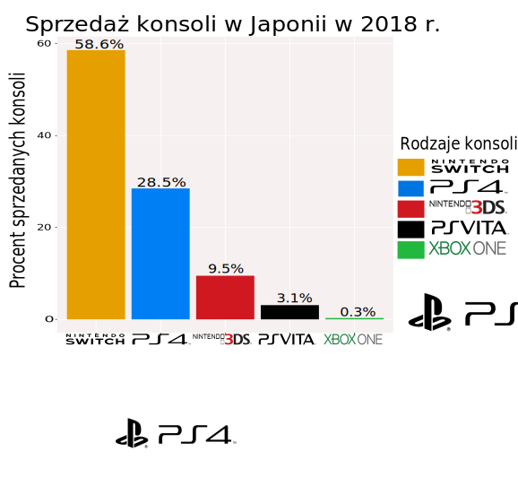

```{r setup, include=FALSE}
library(ggplot2)
library(dplyr)
```
## Dane

Dane liczbowe z poprzedniej pracy domowej.

```{r, echo = FALSE}
console <- c("Nintendo Switch", "PlayStation 4", "Nintendo 3DS", "PS Vita", "Xbox One")
consoles_sold <- c(3482388, 1695227, 566420, 181728, 15339)
consoles_sold_pr <- round((consoles_sold/sum(consoles_sold))*100,digits = 1)
df<- data.frame(console, consoles_sold,consoles_sold_pr)

```

## Stary wykres


```{r, echo = FALSE, fig.width=10}
cbp1 <- c("#999999", "#E69F00", "#56B4E9", "#009E73",
          "#F0E442", "#0072B2", "#D55E00", "#CC79A7")
ggplot(df, aes(x=console,y =consoles_sold_pr , fill=console))+ scale_fill_manual(values = cbp1) + geom_text(aes(label=paste0(consoles_sold_pr,"%")), vjust=-0.3, size=5)+
  geom_bar(stat = "identity") + scale_x_discrete(limits = console)+
  ggtitle("Sprzeda¿ konsoli w Japonii w 2018 r.")+
  labs(y="Procent sprzedanych konsoli", x = "Konsola",fill='Rodzaje konsoli')+ theme(axis.text.x=element_text(size = 12),axis.text.y=element_text(size = 12))

```


## Poprawiony wykres

Za pomoc¹ programu inkscape zmieni³am:

  * szerokoœæ wykresu i s³upków na mniejsze,
  * tytu³ zwiêkszy³am i dopasowa³am do szerokoœci wykresu
  * t³o wykresu sta³o siê bardziej przezroczyste
  * nazwy konsol zamieni³am na firmowe loga
  * kolorystyka s³upków jest podobna do kolorystyki danej generacji konsoli
  * Zwiêkszy³am kwadraciki w legendzie i zwiêkszy³am j¹ objêtoœciowo
  * Zwiêkszy³am wartoœci procentowe przy s³upkach.
  

