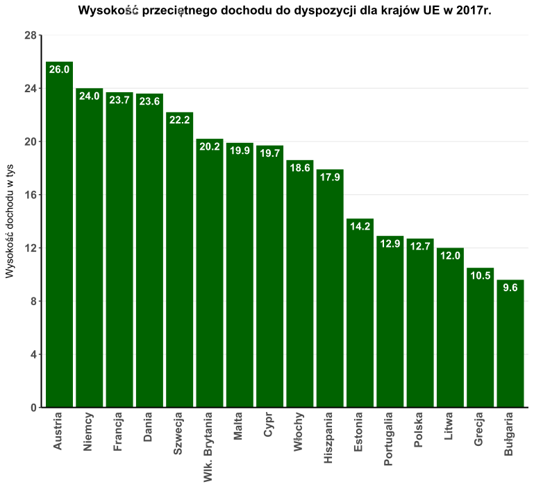
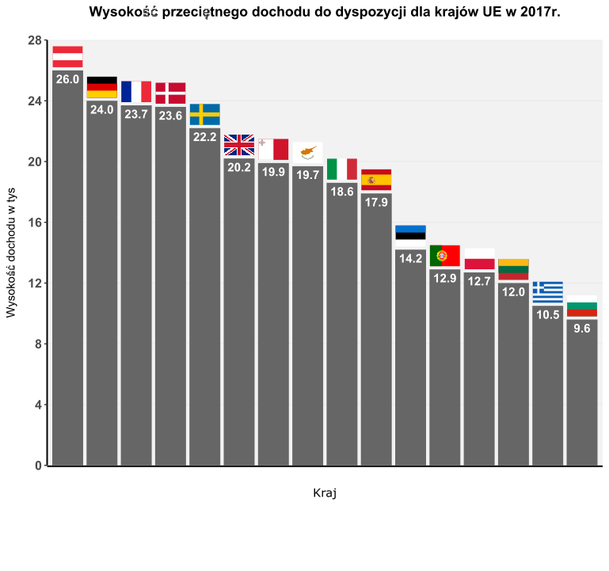

```{r setup, include=FALSE}
knitr::opts_chunk$set(echo = TRUE)
```
## Opis modyfikacji 
-- Zostały dodane flagi zamiast nazw, przez co wykres dedykowany jest tylko dla osób z zaawansowaną znajomością geografii.

-- Wcześniejszy zielony kolor wykresu został zmieniony na nieco bardziej neutralny, ze względu na to, że same flagi są już dość kolorowe.

-- Tło zmieniło kolor na odcień szarego, żeby flagi Malty, Polski, Cypru itp. były lepiej widoczne.


## Oryginalny wykres


```{r plot, echo=FALSE, out.width = '70%'}

```

## Zmodyfikowany wykres


```{r pressure, echo=FALSE, out.width = '70%'}

```