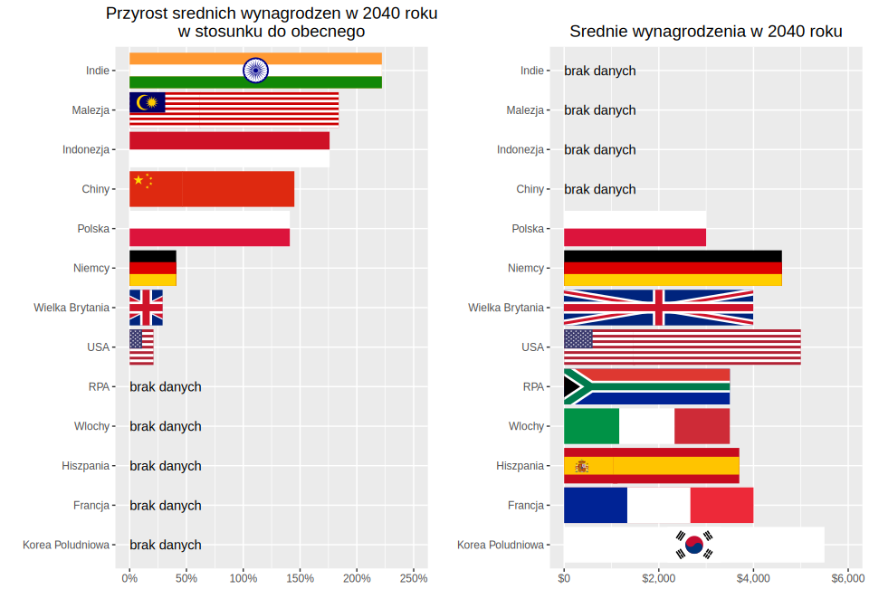

autor: Szymon Kowalik

autor orygina³u: Piotr Olesiejuk <br/>
Link do zrodlowego artykulu: https://bezprawnik.pl/wzrost-wynagrodzen-w-polsce/


# Wersja z poprawkami w Inkscape



# Poprzednia wersja - po PD2

```{r, warning=FALSE, message=FALSE, fig.width = 10, fig.height=7}
library(patchwork)
library(formattable)
library(ggplot2)
library(dplyr)
countries1 <- c("Indie", "Malezja", "Indonezja", "Chiny", "Polska", "Niemcy", "Wielka Brytania", "USA", "Korea Po³udniowa", "Francja", "Hiszpania", "W³ochy", "RPA")
values1 <- c(2.22, 1.84, 1.76, 1.45, 1.41, 0.41, 0.29, 0.21, 0, 0, 0, 0, 0)
values1 <- percent(values1)
dat1 <- data.frame(kraj = countries1, wzrost_pensji = values1) %>% 
  arrange(wzrost_pensji) %>% 
  mutate(is_poland = kraj=='Polska')
kraj_order <- dat1 %>% pull(kraj)

p1 <- ggplot(data = dat1, aes(x = kraj, y = wzrost_pensji, fill=is_poland)) +
  scale_x_discrete(limits = kraj_order) +
  geom_bar(stat = "identity") +
  geom_text(aes(y=wzrost_pensji, label=ifelse(wzrost_pensji>0, '', 'brak danych'), hjust=0)) +
  scale_y_continuous(labels = scales::percent, limits = c(0, 2.5)) +
  coord_flip( )+
  theme(legend.position = "none") +
  xlab("") + ylab("") +
  ggtitle("Przyrost œrednich wynagrodzeñ w 2040 roku\nw stosunku do obecnego")

p1 <- p1 + theme(plot.title = element_text(size = 14, hjust = 0.5))

countries2 <- c("Indie", "Malezja", "Indonezja", "Chiny", "Korea Po³udniowa", "USA", "Niemcy", "Francja", "Wielka Brytania", "Hiszpania", "W³ochy", "RPA", "Polska")
values2 <- c(0, 0, 0, 0, 5500, 5000, 4600, 4000, 4000, 3700, 3500, 3500, 3000)
dat2 <- data.frame(kraj = countries2, pensja = values2) %>% 
  mutate(is_poland = kraj=='Polska')


p2 <- ggplot(data = dat2, aes(x = kraj, y = pensja, fill=is_poland)) +
  scale_x_discrete(limits = kraj_order) +
  scale_y_continuous(labels = scales::dollar_format(), limits = c(0, 6000)) +
  geom_bar(stat = "identity") +
  geom_text(aes(y=pensja, label=ifelse(pensja>0, '', 'brak danych'), hjust=0)) +
  coord_flip() +
  theme(legend.position = "none") +
  xlab("") + ylab("") +
  ggtitle("Œrednie wynagrodzenia w 2040 roku")

p2 <- p2 + theme(plot.title = element_text(size = 14, hjust = 0.5))

p_final <- p1 + p2 

#ggsave(filename = "p.pdf", plot = p_final, device = "pdf", height = 7, width = 10)

p_final
```