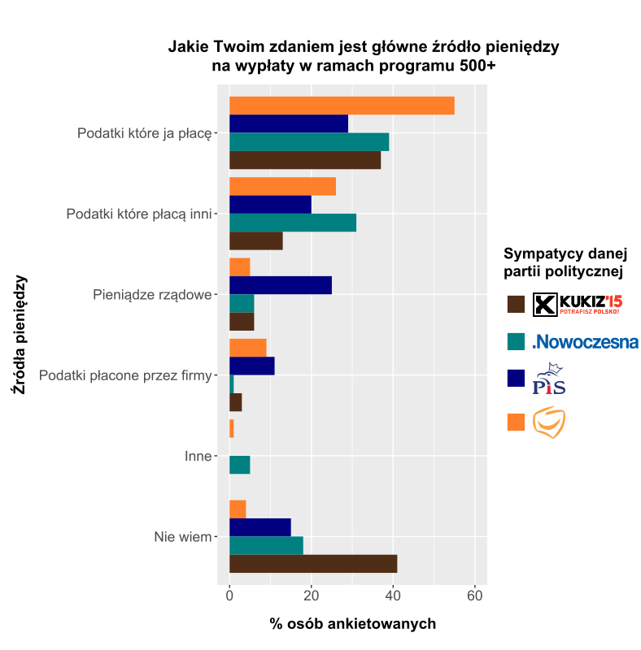

```{R setup, include = FALSE}
knitr::opts_chunk$set(echo = TRUE)
library(dplyr)
library(ggplot2)
library(gridSVG)
```

```{R przygotowanie pliku svg, warning = FALSE, message = FALSE, include = FALSE}
# Dane ---------------------------------------------------------------------------------------------------

procenty <- c(29, 20, 25, 11, 0, 15, 37, 13, 6, 3, 0, 41, 55, 26, 5, 9, 1, 4, 39, 31, 6, 1, 5, 18)

zrodla <- c("Podatki które ja płacę", "Podatki które płacą inni", "Pieniądze rządowe", 
            "Podatki płacone przez firmy", "Inne", "Nie wiem")

partie <- c("PiS", "Kukiz15", "PO", "Nowoczesna")

df <- tibble(procenty = procenty, zrodla = factor(rep(zrodla, 4), levels = zrodla),
             partie = rep(partie, each = 6))


# Wykres -------------------------------------------------------------------------------------------------

wykres_bazowy <- ggplot(df, aes(x = zrodla, y = procenty, fill = partie)) + 
  geom_bar(stat = 'identity', position = "dodge") +
  coord_flip() +
  ylim(0, 60) +
  scale_x_discrete(limits = rev(levels(df$zrodla))) +
  ggtitle("Jakie Twoim zdaniem jest główne źródło pieniędzy\nna wypłaty w ramach programu 500+") + 
  xlab("Źródła pieniędzy") + ylab("% osób ankietowanych") +
  guides(fill=guide_legend(title = "Sympatycy danej\npartii politycznej")) +
  theme(plot.title = element_text(size = 15, face = "bold"),
        axis.text = element_text(size = 13),
        axis.title = element_text(size = 14, face = "bold"),
        legend.title = element_text(size = 14, face = "bold"),
        legend.text = element_text(size = 13))


# Zapis do pliku svg -------------------------------------------------------------------------------------

# svg("wykres_bazowy.svg", height = 7.5, width = 8)
# wykres_bazowy
# dev.off()

```

## Wykres bazowy

```{R wykres bazowy, warning = FALSE, message = FALSE, fig.width = 10, fig.height = 6}
wykres_bazowy
```

## Wykres poprawiony

Za pomocą programu **Inkscape** zostały poprawione następujące rzeczy:

* wyśrodkowanie tytułu względem wykresu i przesunięcie go nieco wyżej (zwiększenie odstępu pomiędzy tytułem a wykresem)
* zwiększenie odstępu między tytułami osi a wartościami na osiach
* zamiana nazw partii na loga partii
* przesunięcie legendy
* zwiększenie odstępów w legendzie
* zamiana kolorów słupków na kolory zbliżone do kolorów danej partii

