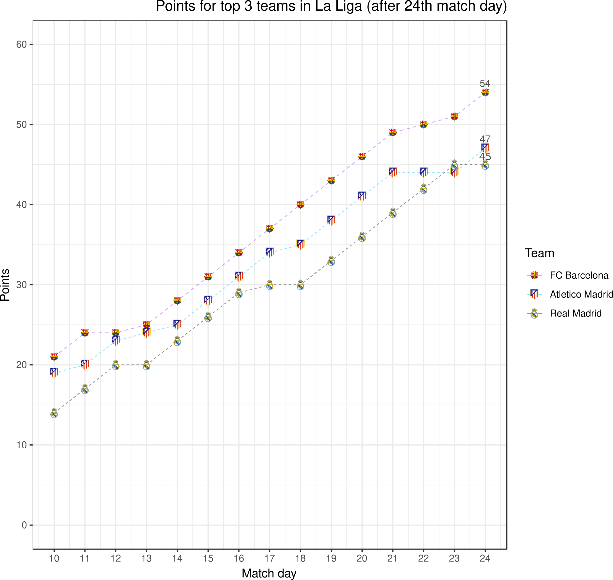

```{r, include=FALSE}
knitr::opts_chunk$set(echo = TRUE, warning = FALSE, error = FALSE, message = FALSE)
```

## Przedmiot zmiany
Źródło: https://github.com/mini-pw/WizualizacjaDanych2018/blob/master/PraceDomowe/PD2/gr1/GrochowskiKosma/GrochowskiKosma.html

### Kod dla oryginalnego wykresu

```{r}
library(ggplot2)
library(reshape2)
library(ggrepel)
library(gridSVG)

# Utworzenie wektorów z danymi, na podstawie których rysowany będzie wykres
jornada <- seq(10, 24)
barcelona <- c(21, 24, 24, 25, 28, 31, 34, 37, 40, 43, 46, 49, 50, 51, 54)
atletico <- c(19, 20, 23, 24, 25, 28, 31, 34, 35, 38, 41, 44, 44, 44, 47)
real <- c(14, 17, 20, 20, 23, 26, 29, 30, 30, 33, 36, 39, 42, 45, 45)

# Zebranie danych w data frame
puntos.data <- data.frame(jornada, barcelona, atletico, real)

# Zebranie pozycji poszczególnych drużyn do jednej kolumny
puntos.long <- melt(puntos.data, id = "jornada", measure = c("barcelona", "atletico", "real"))

# Rysowanie wykresu
my_plot <- ggplot(data = puntos.long, aes(jornada, value, colour = variable, label = value)) + # Skąd i co rysować
  geom_point() + # Rysuj punkty
  geom_line(alpha=0.4) + # Rysuj linie
  scale_x_continuous(breaks = seq(10, 24, by=1), limits=c(10,24)) + # Oś X podpisana co 1
  scale_y_continuous(breaks = seq(0, 60, by=10), limits=c(0,60)) +
  labs(title="Points for top 3 teams in La Liga (after 24th match day)", x="Match day", y="Points", color="Team") + # Zmiana oznaczeń osi i legendy
  scale_color_manual(labels = c("FC Barcelona", "Atletico Madrid", "Real Madrid"), values=c("purple", "deepskyblue1", "black")) + # Zmiana oznaczeń drużyn
  theme_bw() # Wybór stylu

# Zapisywanie wykresu

svg("wykres_przed.svg", height = 7.5, width = 8)
my_plot
dev.off()
```

### Oryginalny wykres
Wykres, który został poprawiony:

```{r echo=FALSE}
my_plot
```

autorstwa Piotra Podbielskiego po poprawkach Kosmy Grochowskiego. 

## Poprawiony wykres
```{r echo=FALSE}

```

## Co zostało poprawione?
* Wyśrodkowano tytuł,
* zmieniono ciągłe linie na przerywane, dzięki czemu sugerowany jest teraz trend punktów,
* zamiast kropek dodano herby klubów, dzięki czemu łatwiej rozpoznać którego klubu dotyczy linia trendu. 