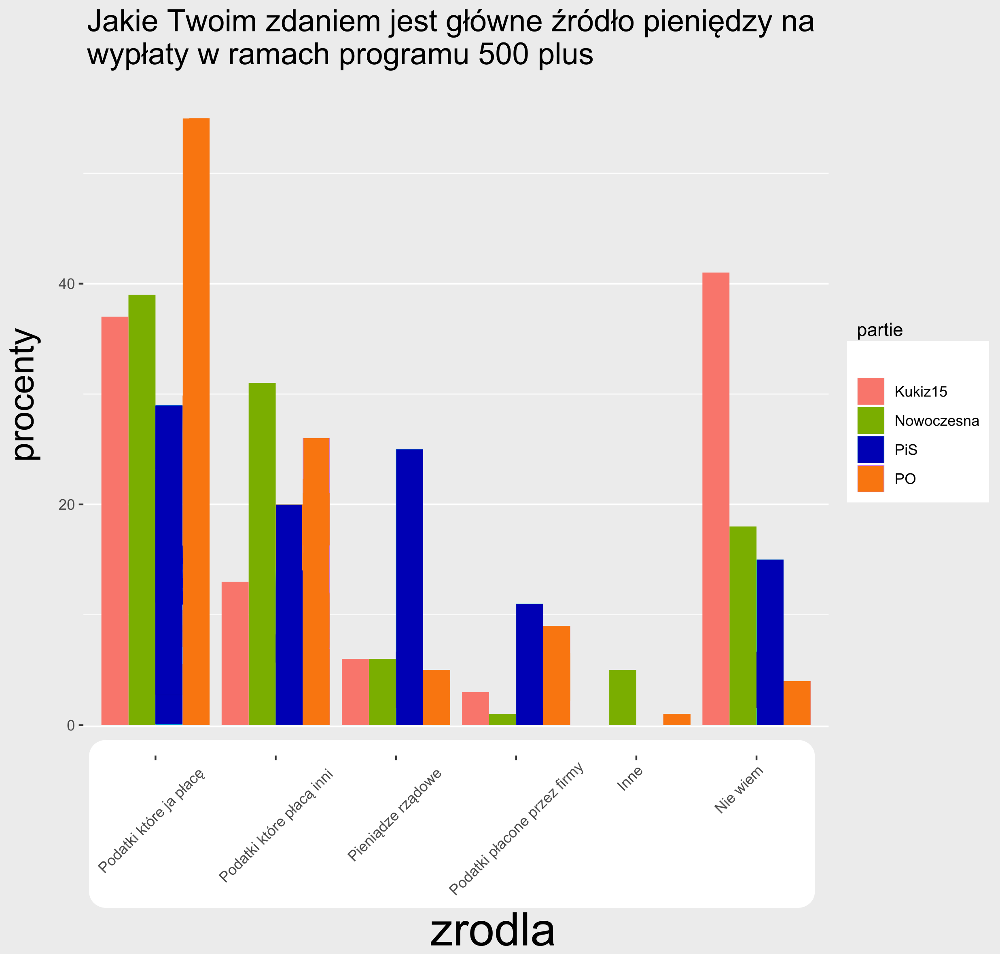

```{r setup, include=FALSE}
knitr::opts_chunk$set(echo = TRUE)
library(dplyr)
library(ggplot2)
library(gridSVG)
```
## Dane

```{r dane}
procenty <- c(29,20,25,11,0,15, 37,13,6,3,0,41,
              55,26,5,9,1,4, 39, 31, 6, 1, 5, 18)
zrodla <- c("Podatki które ja p³acê", "Podatki które p³ac¹ inni", "Pieni¹dze rz¹dowe","Podatki p³acone przez firmy", "Inne", "Nie wiem")
partie <- c("PiS", "Kukiz15", "PO", "Nowoczesna")
df <- tibble(procenty=procenty, zrodla=factor(rep(zrodla, 4), levels=zrodla),
             partie=rep(partie, each=6))
```
## Wykres PD2
```{r newchart, echo=FALSE}
xd<-ggplot(data=df, aes(x=zrodla, y=procenty, fill=partie)) + 
geom_bar(stat='identity', position=position_dodge()) + ggtitle("Jakie Twoim zdaniem jest g³ówne Ÿród³o pieniêdzy na\nwyp³aty w ramach programu 500 plus") +theme(axis.text.x=element_text(angle=45,hjust=1))

xd
```

## Wykres poprawiony




## Dokonane zmiany

1. Usuniêcie pionowych bia³ych linii z t³a wykresu, które w przypadku position=dodge nic nie wnosi³y.

2. zmiana kolorów partii PO i PiS na takie, z którymi siê identyfikuj¹

3. przesuniêcie i zwiêkszenie podpisów osi oraz tytu³u

4. wyœrodkowanie podpisów ka¿dej grupy tak, by znajdowa³y siê centrycznie pod grup¹ czterech s³upków

5. Dodanie bia³ego pola na podpisy grup, aby zwiêkszyæ kontrast.

