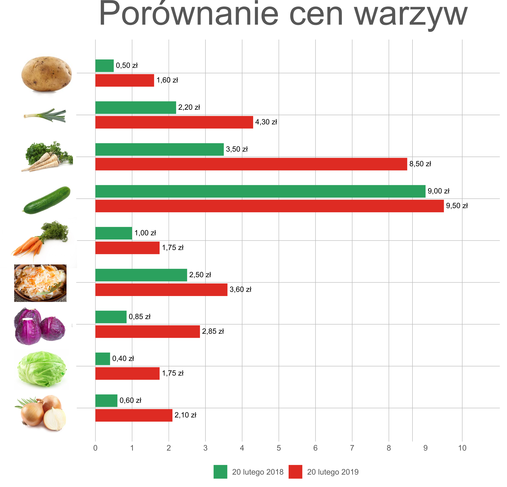

  
```{R setup, include = FALSE}
knitr::opts_chunk$set(echo = TRUE)
library(gridSVG)
library(dplyr)
library(ggplot2)
library(ggthemes)
```

```{R przygotowanie danych, warning = FALSE, message = FALSE, include = FALSE}
# Dane ----------------------------------------------------------------------------
warzywa <- data.frame(warzywo=c(rep("pietruszka", 2), rep("ziemniaki", 2), rep("kapusta biała", 2), rep("kapusta czerwona", 2), rep("kapusta kiszona", 2), rep("cebula", 2), rep("marchew", 2), rep("pory", 2), rep("ogórki", 2)),
                      cena=c(3.50, 8.50, 0.5, 1.60, 0.4, 1.75, 0.85, 2.85, 2.5, 3.6, 0.6, 2.10, 1, 1.75, 2.20, 4.3, 9, 9.5), rok=as.factor(rep(c(2018, 2019), 9)))
knitr::kable(warzywa, align=c('l', 'l', 'l'))

```


```{r wykres i jego export do pliku, include = FALSE}
create_price_label <- function(price) {
  paste(gsub("[.]", ",", as.character(format(price, nsmall=2))), "zł")
}
dodge_value <- -0.7
max_price <- max(warzywa$cena)
p <- ggplot(data = warzywa,
       aes(x = warzywo, y = cena, group = rok, fill = rok, label=create_price_label(cena))) +
  coord_flip() +
  geom_col(position = position_dodge(dodge_value),
           width = 0.6) + 
  scale_fill_manual(values=c("#2ca25f", "#de2d26"), name = "",
                    labels = c("  20 lutego 2018  ", "  20 lutego 2019  ")) +
  scale_x_discrete(expand=expand_scale(0.1, 0)) +
  scale_y_continuous(limits = c(0, max(warzywa$cena) + 1),
                     breaks=0:(max(warzywa$cena) + 1)) +
  geom_text(hjust = -0.1, vjust = 0.4,
    size = 3,
    position = position_dodge(dodge_value)) +
  guides(fill = guide_legend(nrow = 1)) +
  ylab("cena w zł") +
  xlab("") +
  labs(title = "Porównanie cen warzyw") +
  theme_excel_new() +
  theme(plot.title = element_text(hjust = 0.5))
#svg("wykres_bazowy.svg", height = 7.5, width = 8)
#p
#dev.off()

```


## Wykres bazowy

```{R wykres bazowy, echo=FALSE, plot=TRUE,warning = FALSE, message = FALSE, fig.width = 10, fig.height = 6}
p
```

Autor Piotr Olesiejuk 

## Wykres poprawiony

Przy pomocy inkscape zmienione zosta³y nastêpuj¹ce elementy:

* Powiêkszenie tytu³u
* Zamiana nazw warzyw na ich obrazki


