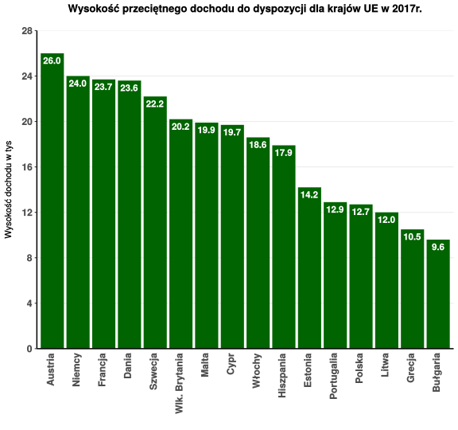
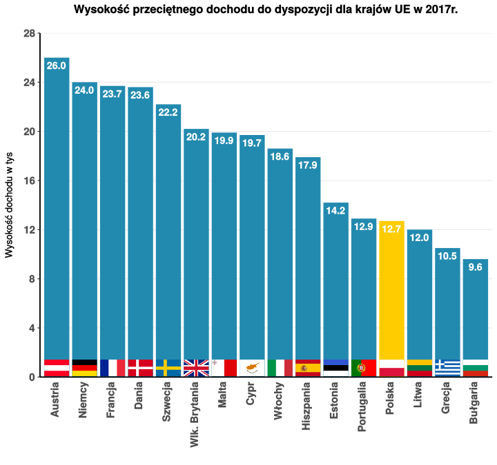

```{r setup, include=FALSE}
knitr::opts_chunk$set(echo = TRUE)
```

# Cel zadania
Celem zadania było zmodyfikowanie wybranego wykresu utworzonego w ramach poprzedniej pracy domowej (drugiej)
przy pomocy programu *Inkscape*.

# Wykres bazowy
Wykres bazowy przedstawia się następująco:


```{r, echo=FALSE}

```

# Wykres zmieniony
Lista modyfikacji wykonanych na bazowym wykresie jest następująca:

* dodanie obrazków przedstawiających flagi krajów. Ów zabieg ubogaca wizualnie wykres.
* zmiana kolorów słupków na niebieski
* wyróżnienie (pokolorowanie na kolor żółty) słupka dla Polski. Dzięki temu, osoba oglądająca może łatwiej zauważyć pozycję Polski w porównaniu do innych państw

Zmodyfikowany wykres przedstawia się następująco:

