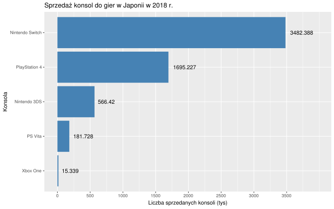
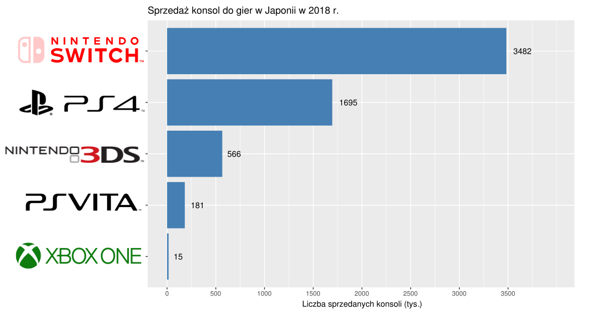

```{r setup, include=FALSE}
knitr::opts_chunk$set(echo = TRUE)
```
### Oryginał


### Zmodyfikowane



Moje zmiany:

* dodanie obrazków konsol
* usunięcie cześci dziesiętnych z wykresu
* dodanie brakującej kropki w tys. :)


PS. Miałem problem po zaimportowaniu zmodyfikowanego wykresu jako svg, pojawiało się tylko jedno logo.
Podejrzewam, że źle zaimportowałem pozostałe
