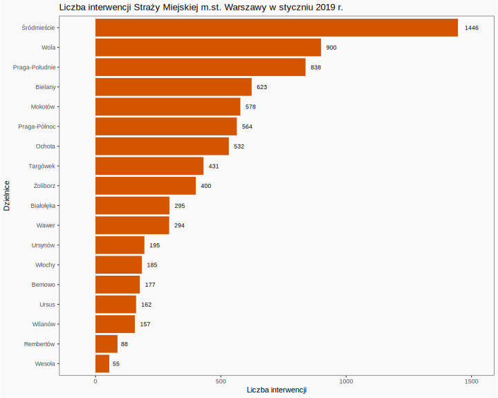

```{r setup, include=FALSE}
knitr::opts_chunk$set(echo = TRUE)
```

## Wykres z PD2


```{r, echo=FALSE, message=FALSE}
library(ggplot2)
library(dplyr)

Dzielnice <- c('Bemowo', 'Bia³o³êka', 'Bielany', 'Mokotów', 'Ochota', 'Praga-Po³udnie', 'Praga-Pó³noc', 'Rembertów', 'Œródmieœcie',  'Targówek', 'Ursus', 'Ursynów', 'Wawer', 'Weso³a', 'Wilanów', 'W³ochy', 'Wola', '¯oliborz')

LiczbaInterwencji <- c(177, 295, 623, 578, 532, 838, 564, 88, 1446, 431, 162, 195, 294, 55, 157, 185, 900, 400)

dane <- data.frame(Dzielnice, LiczbaInterwencji)
dane <- dane %>% mutate(Dzielnica = factor(Dzielnice,levels=rev(unique(Dzielnice))))

ggplot(data=dane, aes(x=reorder(Dzielnica, LiczbaInterwencji), y=LiczbaInterwencji)) + 
  geom_bar(stat='identity') + 
  geom_text(aes(label=LiczbaInterwencji), hjust = -0.5, size = 3, position = position_dodge(width = 1)) + 
  scale_x_discrete() +
  scale_y_continuous(expand = c(.1, .1)) + 
  ggtitle('Liczba interwencji Stra¿y Miejskiej m.st. Warszawy w styczniu 2019 r.') + 
  xlab('Dzielnice') +
  ylab('Liczba interwencji')  +
  coord_flip() +
  theme_bw()

```

## Zmiany

* Usuniêto siatkê.
* Zmodyfikowano kolor t³a i s³upków.

## Zmodyfikowany wykres


