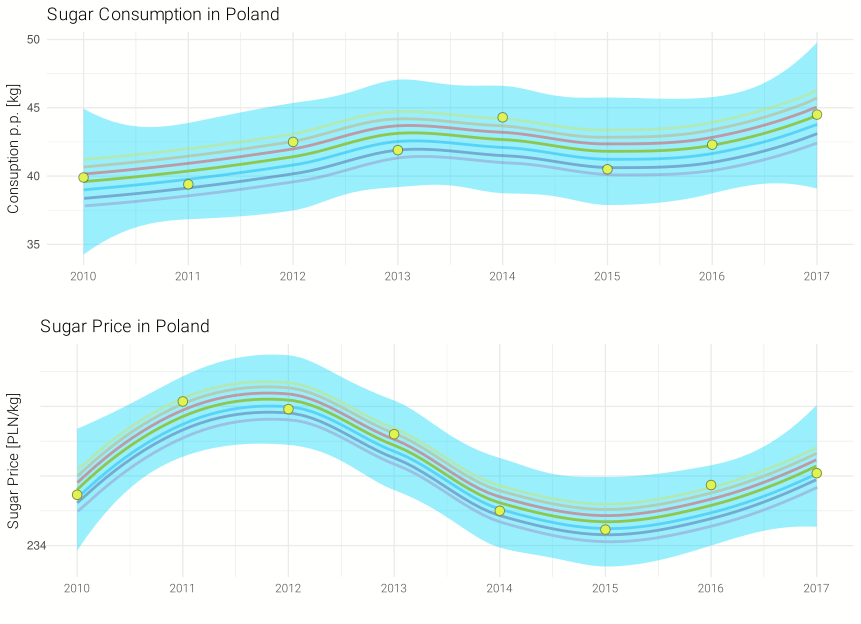

```{r setup, include=FALSE}
library(ggplot2)
# install.packages("devtools")
# devtools::install_github("thomasp85/patchwork")
library(gridExtra)
```

## Oryginał


## Poprawiony Wykres

```{r wyk, echo=FALSE}
years = 2010:2017
consumption = c(39.9, 39.4, 42.5, 41.9, 44.3, 40.5, 42.3, 44.5)
sugar_price = c(2.73, 4.07, 3.96, 3.60, 2.50, 2.23, 2.87, 3.04)

sugar_in_Poland = data.frame(years,
                             consumption,
                             sugar_price)

axis.x <- scale_x_continuous(breaks = years)

p2 <- ggplot(sugar_in_Poland, aes(x = years, y = sugar_price)) +
  ggtitle("Sugar Price in Poland") +
  axis.x +
  geom_point(size = 3) + geom_smooth(method = "loess", formula = y ~ x) +
  xlab("") +
  ylab("Sugar Price [PLN/kg]") + theme_minimal() 

p1 <- ggplot(sugar_in_Poland, aes(x = years, y = consumption)) +
  ggtitle("Sugar Consumption in Poland") +
  axis.x +
  geom_point(size = 3) + geom_smooth(method = "loess", formula = y ~ x) +
  xlab("") +
  ylab("Consuption p.p. [kg]") + theme_minimal() 

p1 <- ggplotGrob(p1)
p2 <- ggplotGrob(p2)

p2$widths <- p1$widths

grid.arrange(p1, p2, ncol=1, heights = c(1, 1))
```

## Inkscape Tęcza


