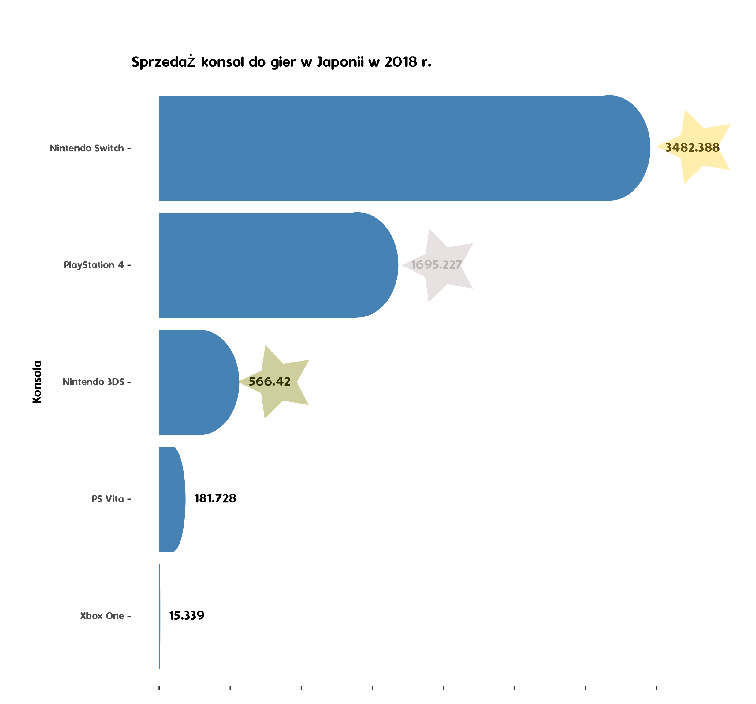

```{r setup, include=FALSE}
knitr::opts_chunk$set(echo = TRUE)
```

## R Markdown

Modyfikacja wykresu Artur Gajowniczek odnośnie sprzedaży konsol do gier.

Dane liczbowe z artykułu:
https://segmentnext.com/2019/02/19/xbox-one-sales-numbers-make-it-the-worst-selling-console-in-japan-for-2018/


```{r, echo=FALSE, message=FALSE}
console <- c("Nintendo Switch", "PlayStation 4", "Nintendo 3DS", "PS Vita", "Xbox One")
consoles_sold <- c(3482388, 1695227, 566420, 181728, 15339)
consoles_sold_tys <-consoles_sold / 1000
df<- data.frame(console, consoles_sold, consoles_sold_tys)

library(ggplot2)
library(tidyverse)
```

## Wprowadzone modyfikacje

1) zmiana prezentowanych wartosci liczbowych na tys, poprawa wyswietlanych wartosci
2) sortowanie informacji na wykresie w sposób nierosnący
3) zmiana domyslnego tematu kolorystycznego na bardziej atrakcyjny
4) umieszczenie na osi y nazw konsoli, na osi x sprzedaży
5) modyfikacja skali na osiach
6) umieszczenie wartości obok słupka

```{r, echo=FALSE}

p<-ggplot(df, aes(x=reorder(console, consoles_sold_tys), y=consoles_sold_tys)) + 
  geom_bar(stat="identity", fill="steelblue") + 
  geom_text(aes(label = paste0(consoles_sold_tys), hjust = -0.2)) +
  ggtitle("Sprzedaż konsol do gier w Japonii w 2018 r.") +
  scale_x_discrete() +
  scale_y_continuous(limits = c(0, max(consoles_sold_tys) +  500), breaks = seq(0, max(consoles_sold_tys) +  500, by = 500)) + 
  xlab('Konsola') +
  ylab('Liczba sprzedanych konsoli (tys)')  +
  scale_fill_brewer(palette="Dark2") +
  coord_flip()

cairo_ps("ZadanieDomowe.eps", height = 7.5, width = 8, family = "Dyuthi")

p


dev.off()

```

## Zmodyfikowany wykres


