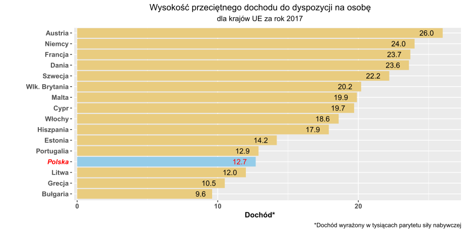

```{r setup, include=FALSE}
knitr::opts_chunk$set(echo = TRUE)
```

## Oryginalny wykres

```{r pressure, echo=FALSE, warning=FALSE,message=FALSE, fig.width=10}
library('ggplot2')
library('dplyr')
library('RColorBrewer')

x <- c("Estonia","Malta","Austria","Polska","Dania","Litwa","Bułgaria","Szwecja","Niemcy","Francja",
       "Włochy","Portugalia","Hiszpania","Cypr","Wlk. Brytania","Grecja")
y <- as.numeric(c(14.2,19.9,26,12.7,23.6,12,9.6,22.2,24.0,23.7,18.6,12.9,17.9,19.7,20.2,10.5))

df = data.frame(country=x,avg_income=y)

order <- df %>% 
  arrange(avg_income) %>% 
  pull(country)

specify_decimal <- function(x, k) trimws(format(round(x, k), nsmall=k))
bold11 <- element_text(size=11,face='bold')
bold10 <- element_text(size=10,face='bold')


ggplot(data=df, aes(x=country,y=avg_income)) + 
  geom_bar(stat='identity',fill='#e9cc7f') +
  geom_text(aes(label=specify_decimal(avg_income,1)),hjust=1.618) + 
  scale_x_discrete(limits = order) +
  labs(y='Dochód*', x=' ',caption='*Dochód wyrażony w tysiącach parytetu siły nabywczej',title='Wysokość przeciętnego dochodu do dyspozycji na osobę',subtitle='dla krajów UE za rok 2017') +
  coord_flip() + 
  theme(
    plot.title = element_text(hjust=0.5),
    plot.subtitle=element_text(hjust=0.5),
    legend.title = bold11,
    axis.title.x = bold11,
    axis.text = bold10
  )

# Added exporting previous plot to pdf

dpi = 100
width <- 960 / dpi * 2.54
height <- 480 / dpi * 2.54
# set correct working directory before
ggsave("pre.pdf", width = width, height = height, dpi = dpi, units = "cm")

```


## Poprawiony wykres



### Co zmieniono

* Dodano polskie znaki
* Wyróżniono Polskę
* Usunięto przerwę pomiędzy nazwami państ a początkiem słupków