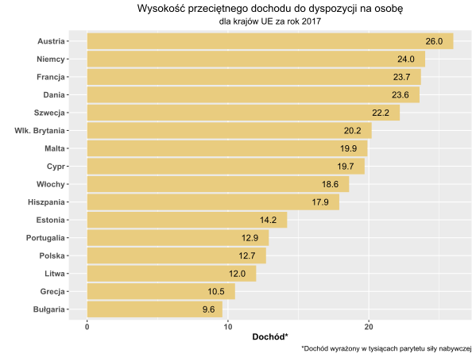
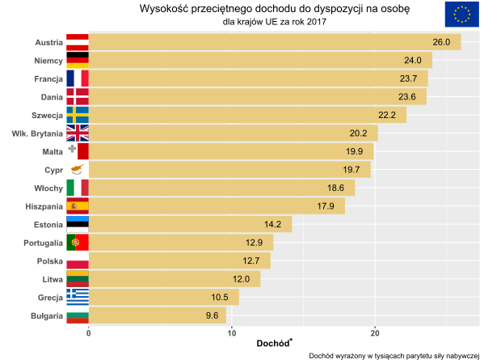

```{r setup, include=FALSE}
knitr::opts_chunk$set(echo = TRUE)
```

## Original plot



## Improvements

I have removed empty space before vertical axis and used this space to add country flags to make the plot more attractive visually. The asterisks used to add description to X axis title were moved a little higher in order to separate them from text and make reading easier.


