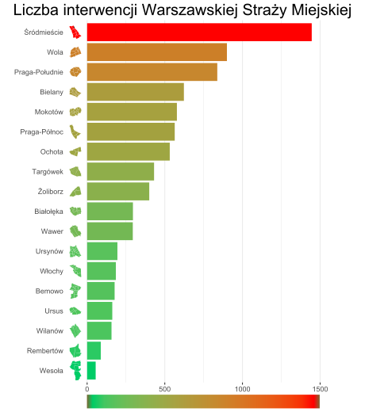

```{r setup, include=FALSE}
knitr::opts_chunk$set(echo = TRUE,
                      warning=FALSE,
                      message = FALSE)
```

## Oryginalny wykres

```{r}
# èrÛd≥o kodu: https://github.com/mini-pw/WizualizacjaDanych2018/pull/179
library(ggplot2)
library(dplyr)
library(forcats)

Dzielnice <- c('Bemowo', 'Bia≥o≥Íka', 'Bielany', 'MokotÛw', 'Ochota', 'Praga-Po≥udnie', 'Praga-PÛ≥noc', 'RembertÛw', 'årÛdmieúcie',  'TargÛwek', 'Ursus', 'UrsynÛw', 'Wawer', 'Weso≥a', 'WilanÛw', 'W≥ochy', 'Wola', 'Øoliborz')
LiczbaInterwencji <- c(177, 295, 623, 578, 532, 838, 564, 88, 1446, 431, 162, 195, 294, 55, 157, 185, 900, 400)

dane <- data.frame(Dzielnice, LiczbaInterwencji)

dane <- dane %>% mutate(Dzielnica = factor(Dzielnice,levels=rev(unique(Dzielnice))))

dane %>%
  mutate(Dzielnica = fct_reorder(Dzielnica, LiczbaInterwencji)) %>%
  ggplot(aes(x= Dzielnica, y= LiczbaInterwencji, fill = LiczbaInterwencji)) + 
  scale_x_discrete() +
  scale_y_continuous() +  
  geom_bar(stat='identity') + 
  labs(title='Liczba interwencji Warszawskiej Straøy Miejskiej',
       x="", y="") + 
  coord_flip() +
  theme_bw() +
  scale_fill_gradient(name = "Liczba interwencji", low="springgreen3", high="red")
```

[èrÛd≥o wykresu](https://github.com/mini-pw/WizualizacjaDanych2018/pull/179)

## Zmodyfikowany wykres
<font color="#9bc4e2">UWAGA! Plik RMD nie wyúwietla skali kolorÛw na samym dole wykresu. Odsy≥a siÍ do pliku ürÛd≥owego ModifiedPlot.svg</font>
<br>
Wprowadzone zmiany:
<ul>
<li> ZwiÍkszono tytu≥ dla lepszej czytelnoúci
<li> UsuniÍto linie poziome nie wnoszπce dodatkowych informacji
<li> Dodano miniaturowe mapy dzielnic, aby polepszyÊ skojarzenie widza
<li> Ujednolicono kolory map dzielnic z kolorami okreslajπcymi dane przedstawione na wykresie
<li> Przeniesiono skale kolorÛw pod wykres
<li> UsuniÍto wartoúci na skali kolorÛw w celu nie duplikowania informacji
</ul>
