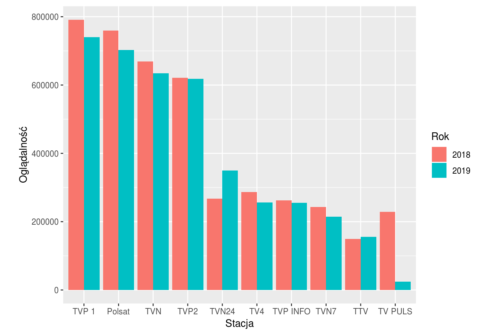
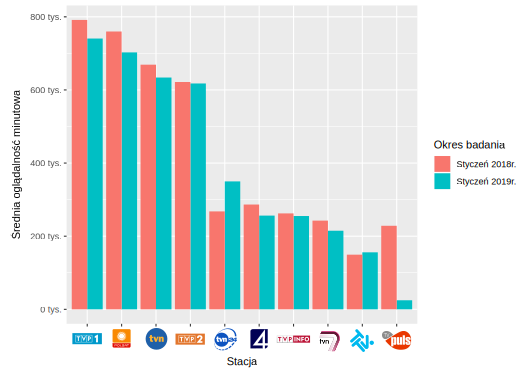

## Poprzedni wykres

Wybrano wykres Marcina Dardzińskiego, który dotyczył oglądalności poszczególnych stacji telewizyjnych w Polsce.

## Wynik poprawek z pracy domowej 2

## Wprowadzone poprawki

* Odsunięto nazwy osi od wartości podziałki
* Zamienono nazwy stacji telewizyjnych na oficjalne loga

