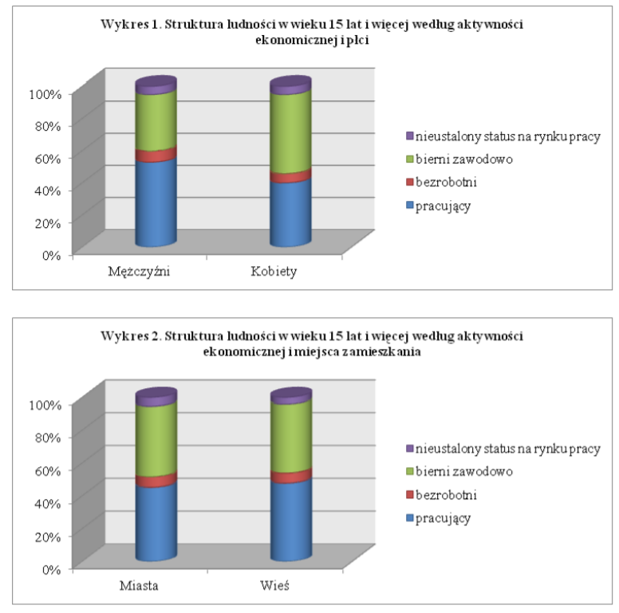

```{r setup, include=FALSE}
knitr::opts_chunk$set(echo = TRUE)
```

## Data source



Stacked bar makes it hard to compare values between categories. Additional raw values are nearly impossible to read from bars.

```{r results='hide', message=FALSE, warning=FALSE}
library(reshape2)
library(ggplot2)
library(grid)
library(gridExtra)

```

## Updated chart

```{r pressure, echo=FALSE, message=FALSE}
category <- c("nieustalony status na rynku pracy", "bierni zawodowo", "bezrobotni", "pracujący")
men <- c(800271, 5504794, 1082640, 8264503)
men <- men / sum(men)
women <- c(871179, 8402675, 967414, 6786138)
women <- women / sum(women)
city <- c(1134364, 8656019, 1285944, 9090543)
city <- city / sum(city)
countryside <- c(537087, 5251450, 764111, 5960098)
countryside <- countryside / sum(countryside)

df1_raw <- data.frame(category, men, women)
df1 <- melt(df1_raw, id.vars='category', value.name="percentage")

gender_plot <- ggplot(df1, aes(fill=category, y=percentage, x=variable)) + 
  geom_bar(position="dodge", stat="identity")

df2_raw <- data.frame(category, city, countryside)
df2 <- melt(df2_raw, id.vars='category', value.name="percentage")

place_plot <- ggplot(df2, aes(fill=category, y=percentage, x=variable)) + 
  geom_bar(position="dodge", stat="identity")

grid.arrange(gender_plot, place_plot, nrow = 2)

```
