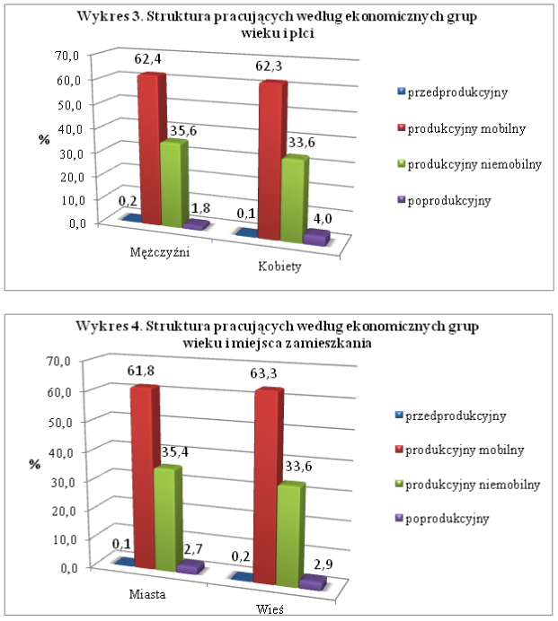

```{r,message=FALSE,warning=FALSE,error=FALSE, echo=FALSE}
knitr::opts_chunk$set(echo=FALSE,warning = FALSE,message = FALSE)
library(DT)
library(dplyr)
library(ggplot2)
library(reshape2)

mezczyzni<-c(0.2,62.4,35.6,1.8)
kobiety<-c(0.1,62.3,33.6,4.0)

miasta<-c(0.1,61.8,35.4,2.7)
wies<-c(0.2,63.3,33.6,2.9)
struct<-c("przedprodukcyjny","produkcyjny mobilny","produkcyjny niemobilny","poprodukcyjny")

dane<-data.frame(struct,mezczyzni,kobiety)
dane2<-data.frame(struct,wies,miasta)

```


## Wykres do poprawienia




## Wykres poprawiony

```{r}
melt(dane) %>% 
  ggplot(aes(x = struct, y = value, fill = variable)) + 
  geom_bar(stat = "identity", position = "dodge")+
  geom_text(aes(label=value), vjust=-0.5, color="black",position = position_dodge(0.9), size=5)+
  scale_fill_brewer(palette="Paired")


melt(dane2) %>% 
  ggplot(aes(x = struct, y = value, fill = variable)) + 
  geom_bar(stat = "identity", position = "dodge")+
  geom_text(aes(label=value), vjust=-0.5, color="black",position = position_dodge(0.9), size=5)+
  scale_fill_brewer(palette="Paired")

```

## Tabelka DT

```{r}
library(DT)
data.frame(dane)
data.frame(dane2)
```

