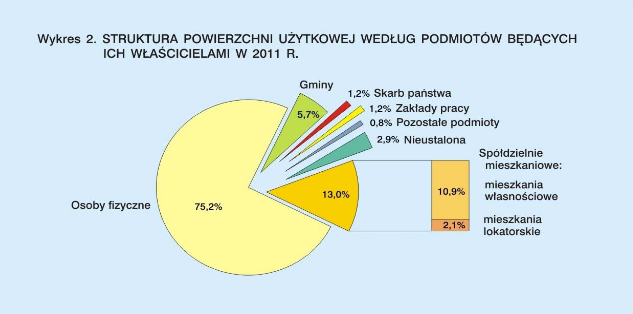

## Oryginalny wykres

```{r setup, include=FALSE}
knitr::opts_chunk$set(echo = TRUE)
```
```{r cars, include=TRUE}

```

## Zmiany
Wizualizacja jest nieczytelna, nalezy usunąć podział spółdzielni 
mieszkaniowych oraz zamienić wykres kołowy na słupkowy

## Poprawiony wykres

```{r echo=TRUE}
library(ggplot2)
entities <-
  c(
    'Osoby fizyczne',
    'Spółdzielnie mieszkaniowe',
    'Gminy',
    'Skarb państwa',
    "Zakłady pracy",
    'Pozostałe podmioty',
    'Nieustalona'
  )
percentage <-
  c(75.2, 13.0, 5.7, 1.2, 1.2, 0.8, 2.9)

structure <-
  data.frame(entities = factor(entities, levels =entities),
             percentage = percentage)
p <-
  ggplot(data = structure, aes(1, percentage, fill=entities))
p + geom_bar(stat="identity", width=0.2) +
  coord_cartesian(xlim = c(0,2))+
  
  scale_fill_manual(
    "",
    values =
      c(
        "blue",
        "orange",
        "blueviolet",
        "gray69",
        "green3",
        "red2",
        "yellow"
      )
  )+
  theme(axis.line=element_blank(),axis.text.x=element_blank(),
          axis.text.y=element_blank(),axis.ticks=element_blank(),
          axis.title.x=element_blank(),
          axis.title.y=element_blank(),
          panel.background=element_blank(),panel.border=element_blank(),panel.grid.major=element_blank(),
          panel.grid.minor=element_blank(),plot.background=element_blank())  +
  ggtitle("Struktura powierzchni użytkowej według podmiotów będących ich właścicielami w 2011 r.") 
```
