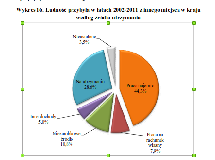

##OPIS

Wykres kołowy jest nieczytelny, pozornie 3d, nie ma zachowanej kolejności(wielkość wycinków).

Za dużo niepotrzebnych kolorów.

Dodano podział na osoby pracujące i nie.

```{r echo=F, out.width='80%'}

```

```{r setup,warning=FALSE,message=FALSE, echo=FALSE}
knitr::opts_chunk$set(echo = FALSE, warning = FALSE)
library(ggplot2)
library(dplyr)
library(stringr)

x <- c('Nieustalone','Praca najemna','Praca na rachunek własny','Niezarobkowe źródło','Inne dochody','Na utrzymaniu')
y <- c(3.5, 44.3, 7.9, 10.8, 5.0, 28.6)
label <- as.factor(c(0,1,1,0,0,0))
data <- data.frame(x =x, y = y, label = label)
data <- data %>% arrange(desc(y))
data$x <- str_wrap(data$x, width = 10)
data$x <- factor(data$x, levels = data$x)

# data %>%  mutate(x = str_wrap(x, width = 10))
# data %>%  mutate(x = factor(x, levels = x))

ggplot(data = data, aes(x = x , y = y, fill= label))+
  geom_col()+
  scale_y_discrete(limits = seq(0,45,5), expand = c(0,0))+
  coord_cartesian(ylim = c(0, 45))+
  scale_fill_manual(name = 'Struktura przychodów',labels = c("Inne źródło zarobków","Pracujący"), values = c("#599ad3","#f9a65a"))+
  theme_bw()+
  theme(panel.grid.major.x = element_blank(),
            plot.title = element_text(face="bold", size=10, hjust=0.0),
            plot.margin = margin(0,0,0,0),
            axis.text.x = element_text(angle = 0, face='bold', hjust = 0.5,size = 10), 
            axis.text.y = element_text(face="bold", size=12),
            panel.border = element_blank(),
            axis.line = element_line(size = 0.7),
            axis.ticks.x = element_blank(),
            axis.title.x = element_blank())+
      labs(title = 'Ludność przybyła w latach 2002-2011 z innego miejsca w kraju według źródła utrzymania')+ylab("Udział procentowy (%)")
```


