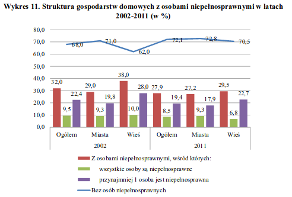

# Oryginalny wykres



Problemy z wykresem:

 * za dużo informacji różnych typów na jednym wykresie
 * dwa typy wykresów na jednym rysunku
 * zdublowana wartość - jenden ze słupków jest sumą dwóch pozosałych

# Wersja poprawiona

```{r,warning=FALSE,message=FALSE}
library(ggplot2)
library(dplyr)
library(reshape2)
library(patchwork)

miejsce <- c('Ogółem', 'Miasto', 'Wieś')
wszyscy <- c(9.5, 9.3, 10)
choc_jedna <- c(22.4, 19.8, 28)
bez <- c(68, 71, 62)
niepelnosprawni <- data.frame(Miejsce = miejsce, Wszyscy = wszyscy, Choc_jedna = choc_jedna, Bez = bez)

miejsce2 <- c('Ogółem', 'Miasto', 'Wieś')
wszyscy2 <- c(8.5, 9.3, 6.8)
choc_jedna2 <- c(19.4, 17.9, 22.7)
bez2 <- c(72.1, 72.8, 70.5)
niepelnosprawni2 <- data.frame(Miejsce = miejsce, Wszyscy = wszyscy, Choc_jedna = choc_jedna, Bez = bez)

p1 <- melt(niepelnosprawni) %>% 
  mutate(Gospodarstwo = factor(variable, labels=c('Z osobami niepełnosprawnymi, wśród których wszystkie osoby są niepełnosprawne\n','Z osobami niepełnosprawnymi, wśród których przynajmniej 1 osoba jest niepełnosprawna','Bez osób niepełnosprawnych')), Procentowo = value) %>% 
  ggplot(aes(x = Miejsce, y = Procentowo, fill = Gospodarstwo), labels=c('x','y','z')) +
  geom_bar(stat="identity") +
  theme(legend.position="bottom") +
  ggtitle("2002")

p2 <- melt(niepelnosprawni2) %>% 
  mutate(Gospodarstwo = factor(variable, labels=c('Z osobami niepełnosprawnymi, wśród których wszystkie osoby są niepełnosprawne','Z osobami niepełnosprawnymi, wśród których przynajmniej 1 osoba jest niepełnosprawna','Bez osób niepełnosprawnych')), Procentowo = value) %>% 
  ggplot(aes(x = Miejsce, y = Procentowo, fill = Gospodarstwo), labels=c('x','y','z')) +
  geom_bar(stat="identity") +
  theme(legend.position="bottom") +
  ggtitle("2011")

p1 + p2
```

