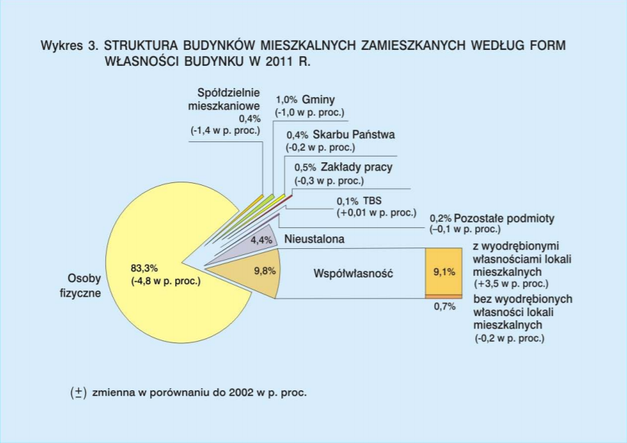

```{r error=FALSE, message=FALSE, warning=FALSE}
library(ggplot2)
library(dplyr)

kategorie <- c("Osoby fizyczne", "Współwłasność", "Współwłasność", "Inne", "Inne", "Inne", "Inne", "Inne",
               "Inne", "Inne")
podkategorie <- c("Osoby fizyczne", "Współwłasność z wyodrębnionymi własnościami lokali mieszkalnych",
                  "Współwłasność bez wyodrębnionych własności lokali mieszkalnych", "Nieustalona",
                  "Spółdzielnie mieszkaniowe", "Gminy", "Skarbu Państwa", "Zakłady pracy", "TBS", 
                  "Pozostałe podmioty")
procenty <- c(83.3, 9.1, 0.7, 4.4, 0.4, 1, 0.4, 0.5, 0.1, 0.2)

df <- data.frame(kategorie, podkategorie, procenty)

ggplot(data = df, aes(x = reorder(podkategorie, procenty), y = procenty)) +
  geom_bar(stat='identity')+
  geom_text(aes(label = procenty), size=3, hjust = -1) + 
  coord_flip() +
  ggtitle("Struktura budynków mieszkalnych") +
  labs(y="Punkty procentowe", x = "Formy własności")
```