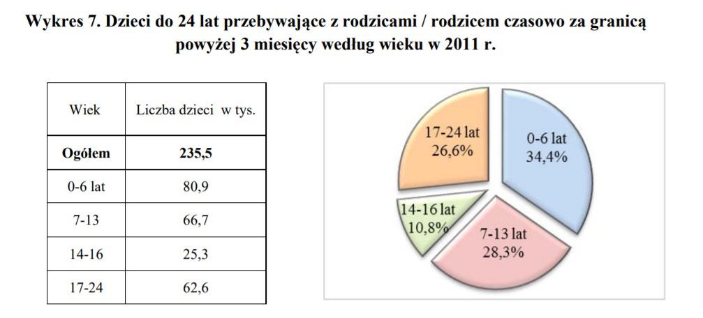

##Stary obrazek
http://stat.gov.pl/obszary-tematyczne/ludnosc/migracje-zagraniczne-ludnosci/gospodarstwa-domowe-i-rodziny-z-migrantami-nsp-2011,12,1.html
```{r echo = FALSE,fig.align='center'}
knitr::opts_chunk$set(echo = FALSE, message = FALSE, warnings = FALSE)

```

##Poprawiony obrazek

```{r fig.align='center'}
library(dplyr)
library(ggplot2)
library(SmarterPoland)
library(ggthemes)
data <- data.frame(wiek = factor(c("Ogó³em", "0-6","7-13","14-16","17-24"), levels = c("Ogó³em", "0-6","7-13","14-16","17-24")), 
                     ld = c( 235.5  , 80.9     , 66.7 , 25.3  , 62.6))

data %>% ggplot(aes(x = wiek, y = ld))+
  geom_bar(stat = "identity") + 
  labs(title = 'Dzieci do 24 lat przebywaj¹ce z rodzicami / rodzicem czasowo
  za granic¹ powy¿ej 3 miesiêcy wed³ug wieku.',    caption = "Dane z 2011 r.") +
  ylab("Liczba dzieci w tys.") +
  xlab("Wiek w latach") +
  theme_calc()
```


Po pierwsze u¿yie tabelki i wykresu ko³owego to nadmiarowaæ w reprezentacji. 
U¿ycie reprezentacji ko³owej do danych czasowych (wieku dzieci) to te¿ bardzo z³y pomys³. 
Bior¹c pod uwagê dwa powy¿sze argumenty zdecydowa³em siê u¿yæ wykresu s³upkowego.