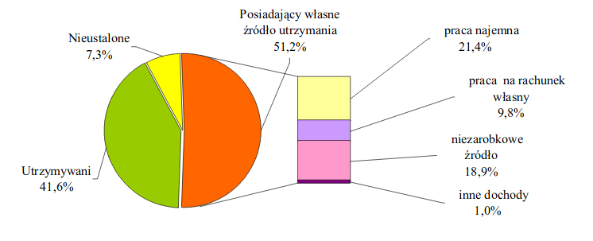

##Nowy wykres


```{r}
header1 <- c("Nieustalone", "Utrzymywani", "Zarabiający")
dane1 <- c(0.073, 0.416, 0.512)

header2 <- c("Praca najemna",
             "Niezarobkowe źródło", 
             "Praca na własny rachunek",
             "Inne dochody")
dane2 <- c(0.214, 0.189, 0.098, 0.01)


ramka1 <- data.frame(header1, dane1)
ramka2 <- data.frame(header2, dane2)

library(ggplot2)
library(patchwork)
library(scales)
library(ggthemes)

p1 <- ggplot(ramka1, aes(x = header1, y = dane1)) + 
  geom_bar(stat = "identity", fill = "#2ca25f") +
  scale_y_continuous(labels = percent) +
  coord_flip() +
  xlab("") +
  ylab("") +
  ggtitle("Imigranci ze względu na rodzaj utrzymania") +
  theme_fivethirtyeight() +
  theme(legend.position = "none", plot.title = element_text(hjust = 0.5))
  

p2 <- ggplot(ramka2, aes(x = header2, y = dane2)) + 
  geom_bar(stat = "identity", fill = "#2ca25f") +
  scale_y_continuous(labels = percent) +
  coord_flip() +
  xlab("") +
  ylab("") +
  ggtitle("Pozyskiwanie dochodu osób zarabiających") +
  theme_fivethirtyeight() +
  theme(legend.position = "none",  plot.title = element_text(hjust = 0.5))

p1 / p2

```

## Stary wykres


