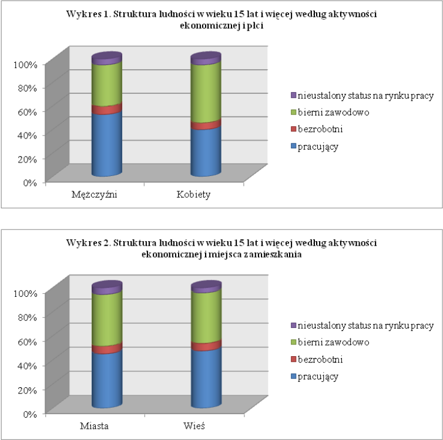

```{r setup, include=FALSE}
knitr::opts_chunk$set(echo = FALSE, message=FALSE, warning = FALSE, error = FALSE)
```

## Oryginalny wykres



## Poprawiony wykres

```{r}
# pracujace, bierni, bezrobotni, nieustalony
# K - 55.6, 37.1, 7.3 
# M - 42, 52, 6.0

# Miasto - 47.8, 45.5, 6.8
# Wies - 49.8, 43.9, 6.4

library(ggplot2)
library(ggpubr)

kobiety = c(55.6, 37.1, 7.3, 1)
mezczyzni = c(42, 52, 6.0, 1)
miasta = c(46.8, 44.5, 6.8, 2)
wies = c(46.8, 44.5, 6.8, 2)


plec=c('Kobiety', 'Kobiety', 'Kobiety', 'Kobiety', 'Mężczyźni', 'Mężczyźni', 'Mężczyźni', 'Mężczyźni')
zamieszkanie = c('Miasto', 'Miasto', 'Miasto', 'Miasto', 'Wieś', 'Wieś', 'Wieś', 'Wieś')
status = c('pracujacy', 'bierni zawodowo', 'bezrobotni', 'nie ustalono statusu na rynku pracy',
           'pracujacy', 'bierni zawodowo', 'bezrobotni', 'nie ustalono statusu na rynku pracy')
status = factor(status, levels=c('nie ustalono statusu na rynku pracy', 'bierni zawodowo', 'bezrobotni', 'pracujacy'))


df1 <- data.frame(plec=plec, status=status, procent=c(kobiety, mezczyzni))
df2 <- data.frame(zamieszkanie=zamieszkanie, status=status, procent=c(miasta, wies))

p1 <- ggplot(data=df1, aes(x=plec, y=procent, fill=status)) +
  geom_bar(stat='identity')

p2 <- ggplot(data=df1, aes(x=zamieszkanie, y=procent, fill=status)) +
  geom_bar(stat='identity')

ggarrange(p1, p2, nrow = 1, ncol=2, common.legend=TRUE, legend='bottom')


```

## Opis zmian

Wykres 3-wymiarowy został zastąpiony 2-wymiarowym, ponieważ dodatkowy wymiar nie wnosił żadnej informacji, a utrudniał interpretację danych.
