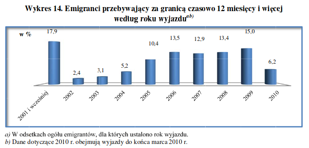

```{R setup, include=FALSE}
knitr::opts_chunk$set(echo = TRUE)
```

## Screen z raportu



## Co jest nie tak?

* brak pionowej osi
* 'latające' etykiety
* brzydkie ramki

## Dobry wykres

```{R, message = FALSE, warning = FALSE, error = FALSE, echo = FALSE}
years <- c("2001\ni wcześniej", "2002", "2003", "2004", "2005", "2006", "2007", "2008", "2009", "2010")
percents <- c(17.9, 2.4, 3.1, 5.2, 10.4, 13.5, 12.9, 13.4, 15.0, 6.2)
df <- data.frame(years, percents)

library(ggplot2)
ggplot(df, aes(x = years, y = percents)) +
  geom_bar(stat = "identity", fill = "lightpink2") +
  ylim(0, 20) +
  geom_label(aes(label = percents), vjust = -0.2) +
  ggtitle("Emigranci przebywający za granicą czasowo 12 miesięcy i więcej\nwedług roku wyjazdu") +
  xlab("Rok") + ylab("Liczba %") +
  theme(plot.title = element_text(size = 15, face = "bold"),
        axis.text = element_text(size = 13),
        axis.title = element_text(size = 14, face = "bold"),
        legend.title = element_text(size = 14, face = "bold"),
        legend.text = element_text(size = 13))
```
