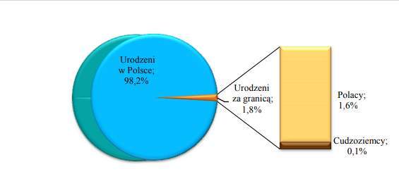

```{r setup, include=FALSE}
knitr::opts_chunk$set(echo = FALSE)
```

# Zrzut ekranu z raportu
```{r}

```

# Co jest złego względem gramatyki grafiki?

* Przedstawienie danych w postaci wykresu kołowego 3D wraz z eksplodującym, zgrupownym wykresem słupkowym jest redundantnym sposobem przedstawienia informacji.

# Poprawiony wykres

```{r}
library(ggplot2)
library(ggrepel)
library(gridExtra)
library(grid)
miejsce_urodzenia <- c(98.2,1.8)
urodzeni <- c("Urodzeni w Polsce", "Urodzeni za granicą")

my_data <- data.frame(Value=miejsce_urodzenia,
                      Miejsce=urodzeni)


my_plot <- ggplot(my_data, aes(x="", y=Value, fill=Miejsce)) + 
  geom_bar(stat="identity", width=1) + 
  coord_polar("y", start=0) + 
  #geom_text(aes(label = paste0(Value, "%")), position = position_stack(vjust = 0.5)) + 
  geom_label_repel(
    aes(label = paste0(Value, "%")), 
    show.legend=FALSE) +
  labs(x = NULL, y = NULL, fill = NULL, title = "Ludność Polski według miejsca urodzenia w 2011 roku") + 
  theme_classic() + 
  theme(axis.line = element_blank(),
    axis.text = element_blank(),
    axis.ticks = element_blank(),
    plot.title = element_text(hjust = 0.5, color = "#666666"))


my_data_2 <- data.frame(Value=c(94.1, 5.9),
                      Miejsce=c("Polacy", "Cudzoziemcy"))


my_plot_2 <- ggplot(my_data_2, aes(x="", y=Value, fill=Miejsce)) + 
  geom_bar(stat="identity", width=1) + 
  coord_polar("y", start=0) + 
  #geom_text(aes(label = paste0(Value, "%")), position = position_stack(vjust = 0.5)) + 
  geom_label_repel(
    aes(label = paste0(Value, "%")), 
    show.legend=FALSE) +
  labs(x = NULL, y = NULL, fill = NULL, title = "Struktura ludności Polski urodzonej za granicą w 2011 roku") + 
  theme_classic() + 
  theme(axis.line = element_blank(),
    axis.text = element_blank(),
    axis.ticks = element_blank(),
    plot.title = element_text(hjust = 0.5, color = "#666666"))

grid.arrange(my_plot, my_plot_2, 
             ncol = 1)
```