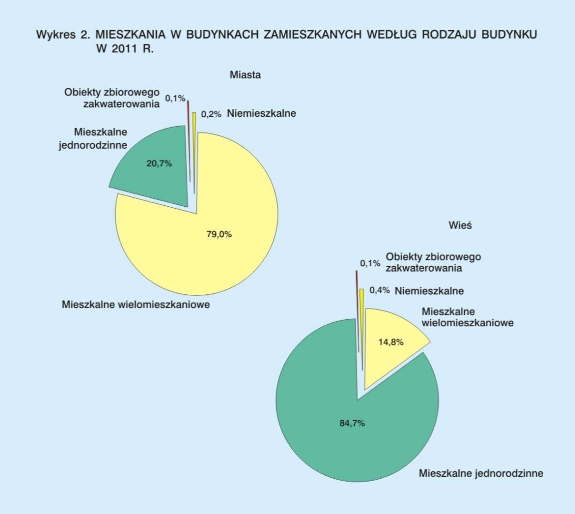

```{r setup, include=FALSE}
knitr::opts_chunk$set(echo = TRUE)
library(dplyr)
library(ggplot2)
```
# Poprawiamy wykres z NSP

## Wykres bazowy




Wykres przedstawia podział mieszkań w budynkach zamieszkanych według rodzaju budynku w 2011r.


Co w nim jest nie tak?:  
1) Dane ukazane są w postaci eksplodującego barchartu.    
2) Ciężko jest porównać wizualnie stosunek `miasto` - `wieś`.   
3) Nie ma jednej legendy adekwatnej do obu wykresów.  
4) Dwa kolory żółte mocno zlewają się ze sobą.

## Wczytanie danych
```{r dane}
df <- tibble(rodzaj_budynku = rep(c("Obiekty zbiorowego zakwaterowania", "Niemieszkalne", "Mieszkalne wielomieszkaniowe", "Mieszkalne jednorodzinne"), 2),
             procenty=c(0.1,0.2, 79,20.7,0.1,0.4,14.8,84.7),
             typ=rep(c("Miasto", "Wieś"), each=4))

```


## Nowy wykres


```{r nowy wykres}
ggplot(data=df, aes(x=rodzaj_budynku, y=procenty / 100)) + geom_bar(stat='identity', aes(fill=typ)) + geom_label(aes(label=procenty), nudge_y = 0.1) + 
  scale_y_continuous(labels = scales::percent, limits=c(0,1))  + facet_wrap(~typ) + theme(legend.position="none") +
  coord_flip() +  ylab("Procenty") + labs(title = 'Podział mieszkań w budynkach zamieszkanych według \nrodzaju budynku w 2011r.',caption = "Dane z NSP 2011") + xlab("Rodzaj budynku") 
```

## Co zostało poprawione:
1)  Zmieniony typ wykresu,
2)  Przestawiono dane obok siebie, tak by łatwiej było porównać miasto i wieś.
3)  Poprawiono czytelność całego wykresu dodając ramki na tekst i lepsze skale.