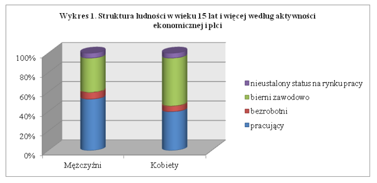

## R Markdown

```{r,message=FALSE,warning=FALSE,error=FALSE,echo=FALSE}
knitr::opts_chunk$set(echo=FALSE)
```


```{r, message = FALSE, warning = FALSE, error=FALSE}
library(ggplot2)
library(dplyr)
library(tidyr)
library(scales)

#Wśród mężczyzn w wieku 15 lat i więcej ponad połowa to osoby pracujące (55,6%),
#podczas gdy bierni zawodowo stanowili 37,1%. Natomiast wśród kobiet w wieku 15 lat
#i więcej osoby pracujące stanowiły 42,0%, a nieco ponad połowa (52,0%) to osoby bierne
#zawodowo. Odsetki osób bezrobotnych różniły się w obu subpopulacjach nieco mniej,
#bowiem udział bezrobotnych wśród mężczyzn wyniósł 7,3%, a wśród kobiet – 6,0%. 

typ <- c("pracujący", "nieustalony", "bierny", "bezrobotni")
# 1 - 0.556 - 0.371 = 0.073
mężczyźni = c(0.556, 0.035, 0.371, 0.038)
# 1 - 0.42 - 0.52 = 0.06
kobiety = c(0.42, 0.031, 0.52, 0.029)

#Mieszkańcy miast i mieszkańcy wsi, będący w wieku 15 lat i więcej,  nie różnili się w sposób  
#znaczący  pod  względem  struktury  według  aktywności  ekonomicznej.  Udział pracujących wśród 
#mieszkańców miast wyniósł 47,8%, a wśród mieszkańców wsi –  49,8%, udziały  bezrobotnych  wyniosły  
#odpowiednio  –6,8%  i  6,4%,  natomiast  udziały  biernych zawodowo – 45,5% i 43,9%. 

countryside = c(0.498, 0, 0.439, 0.063)
city = c(0.478, 0, 0.455, 0.067)


#"countryside", "city",
#, countryside, city
work_status_df = data.frame(typ, mężczyźni, kobiety)
work_status_narrow_df = gather(work_status_df, "płeć", "share",  mężczyźni, kobiety)
work_status_narrow_df

work_by_gender <- mutate(work_status_narrow_df,
                pct = share * 100) 

work_by_gender

ggplot(work_by_gender, aes(x = płeć, fill = typ, y = share)) +
  geom_bar(stat = "identity", position = "stack", width=0.4 ) +
  geom_text(aes(label = paste0(pct, '%' )), position = position_stack(vjust=0.5), size=3, fontface="bold")

```

```{r}

```
