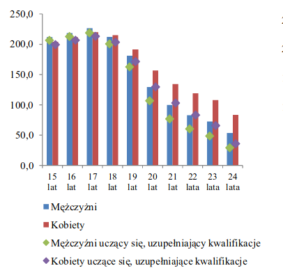

```{r}
library(ggplot2)
library(reshape2)
knitr::opts_chunk$set(echo = TRUE)
```


Zmieniłem dziwne kwadraty na "stacked barplot"


```{r}
dane = data.frame(categories=c("15 lat", "16 lat", "17 lat", "18 lat", "19 lat", "20 lat", "21 lat", "22 lat", "23 lat", "24 lat"),
                  man=c(211.9, 218.4, 226.4, 212.3, 181.2, 129.3, 99.8, 82.8, 72.5, 53.6),
                  man_study = c(206.5, 212.8, 218.8, 200.7, 162.7, 106.8, 76.9, 60.4, 48.6, 29.3),
                  woman=c(204, 211.4, 219.8, 215.1, 191.6, 156.8, 134.2, 119.1, 107.8, 83.6),
                  woman_study=c(199.4, 206.7, 213.2, 203.4, 171.5, 129.7, 103.1, 83.2, 65.9, 35.9))

dfm <- melt(dane)
dfm
```


```{r}
ggplot(data = dfm, aes(x = categories, fill = variable, y=value)) + 
  geom_bar(position='stack', stat="identity") +
  scale_fill_manual(values=c("green","blue","red","pink"),
                    labels = c("męzczyźni", "mężczyźni podnoszący swoje kwalifikacje", "kobiety", "kobiety podnoszące swoje kwalifikacje")) +
  labs(title = "Bierni zawodowo według wieku, płci i wybranej przyczyny bierności", y = "Liczba ludzi (tyś)", x = "Wiek")
```


