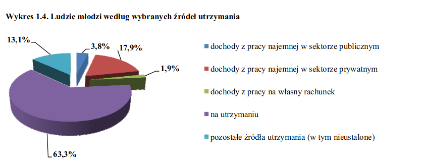

```{r setup, include=FALSE}
knitr::opts_chunk$set(echo = TRUE)
library(ggplot2)
library(dplyr)
```

# Oryginalny wykres
Oryginalny wykres pochodzi z raportu *NSP*.



# Co powinno być poprawione
Poprawiłabym następujące kwestie:

* *formę* - zamieniłabym wykres kołowy na wykres słupkowy, gdyż w przedstawionym wykresie kołowym bardzo trudno odczytać dane proporcje (niektóre wycinki są słabo widoczne lub bardzo zbliżone do siebie pod względem wielkości)
* *przesunięcie* - wartości liczbowe zawarte byłyby na słupkach
* dane posortowałabym od największej do najmniejszej wartości udziału procentowego, dzięki temu czytelnik znacznie szybciej mógłby odczytać, jaka wartość jest najczęstsza

# Poprawiony wykres
```{r, echo = FALSE, warning = FALSE, error=FALSE}
data <- data.frame(name = c("dochody z pracy najemnej w sektorze publicznym", "dochody z pracy najemnej w sektorze prywatnym", "dochody z pracy na rachunek własny", "na utrzymaniu", "pozostałe źródła utrzymania (w tym nieustalone)"),
                   procent = c(3.8, 17.9, 1.9, 63.3, 13.1)) %>% arrange(desc(procent)) %>% mutate(name=factor(name, levels=name))

ggplot(data, aes(x = name, y = procent)) +
  geom_bar(stat = "identity", aes(fill = name)) +
  geom_text(aes(label=paste0(formatC(data$procent, digits=1, format="f"), "%")),
            color = "Black",
            vjust=-0.5,
            size=4,
            angle=0) +
  labs(x = "", y = "procent") + 
  theme(axis.text.x = element_blank()) +
  guides(fill=guide_legend(title="rodzaj dochodów"))
```