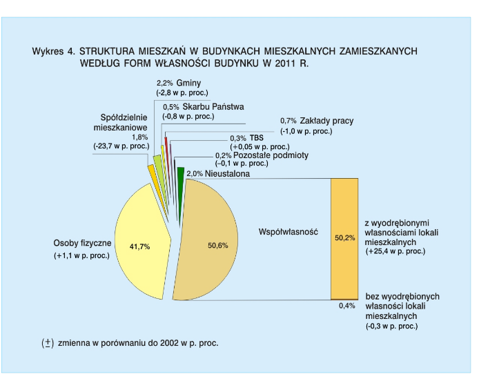

```{r setup, include=FALSE}
knitr::opts_chunk$set(echo = TRUE)
```

```{r, echo=FALSE, message=FALSE, warning=FALSE}
library(ggplot2)
library(stringr)
library(dplyr)
categories <- c("Osoby fizyczne",
                "Spółdzielnie mieszkaniowe",
                "Gminy",
                "Skarb państwa",
                "Zakłady pracy",
                "TBS",
                "Pozostałe podmioty",
                "Nieustalona",
                "Współwłasność z wyodrębnionymi własnościami lokali",
                "Współwłasność bez wyodrębnionych własności lokali")
wlas <- c(0.417,
          0.018,
          0.022,
          0.005,
          0.007,
          0.003,
          0.002,
          0.02,
          0.502,
          0.004)
diff <- c(0.011,
          -0.237,
          -0.028,
          -0.008,
          -0.01,
          0.0005,
          -0.001,
          0,
          0.254,
          -0.003)

categories2 <- str_wrap(c(categories, categories), 20)
wlas2 <- c(wlas, wlas - diff)
rok <- c(rep(2011, 10), rep(2002, 10))
df <- data.frame(Typ = categories2, Wlasnosc = wlas2, Rok = rok) %>% 
  mutate(wlasnosc_nice = paste0(round(Wlasnosc*100, 2), "%"))
ggplot(data=df, aes(x=reorder(Typ, -Wlasnosc), y=Wlasnosc, fill=factor(Rok))) +coord_flip() +
  geom_bar(stat =  "identity", position = "dodge") +
  geom_text(aes(label = wlasnosc_nice), position=position_dodge(width=1), hjust = -0.05, size = 3) +
  scale_y_continuous(labels = scales::percent) +
  theme(legend.position="bottom")
```