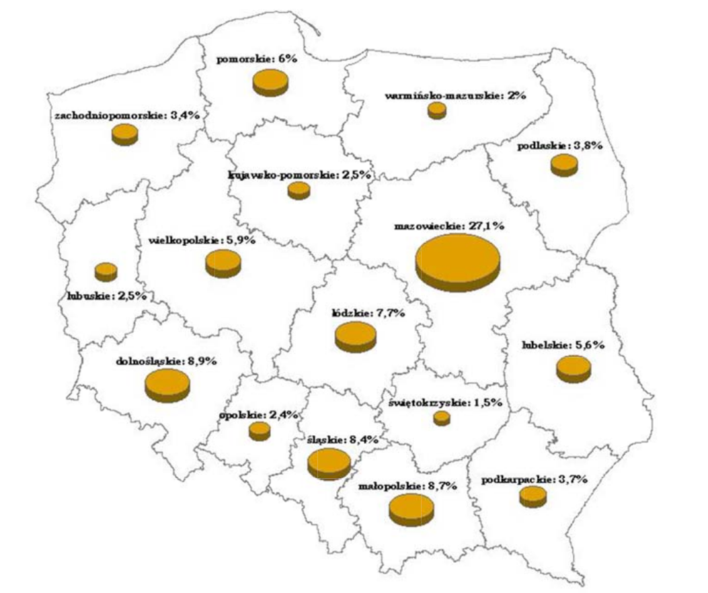

```{r setup, include=FALSE}
knitr::opts_chunk$set(echo = TRUE)
```

## Stary Wykres



Na opublikowanym wykresie, dobrana geometria jest dyskusyjna. O ile prezentacja danych powiązanych z geografią na mapie ma sens,
to są to jednak dane ilościowe, które należałoby móc w prosty sposób porównywać. Wykresy kołowe dla każdego województwa są całkowicie redundantne. Pomijając niepotrzebne dodanie trzeciego wymiaru, wszystkie wykresy prezentują wartość 100%. Najważniejsze dane (procentowa ilość imigrantów w odniesieniu do liczby imigrantów w całej Polsce) jest zaprezentowana jako mało przemawiający do wyobraźni tekst.


## Poprawiony Wykres


```{r pressure, echo=FALSE,message=FALSE }
library(ggplot2)
library(SmarterPoland)
library(dplyr)
library(DT)


nice_percent <- function(x)
  scales::percent(..., scale = 0.1)

Wojewodztwa <- c('Pomorskie', 'Zachodniopomorskie', 'Warmińsko-Mazurskie', 'Podlaskie', 'Lubuskie', 'Wielkopolskie', 'Kujawsko-pomorskie', 'Mazowieckie', 'Dolnośląskie',  'Opolskie', 'Łódzkie', 'Świętokrzyskie', 'Lubelskie', 'Śląskie', 'Małopolskie', 'Podkarpackie')
Imigranci <- c(6, 3.4, 2, 3.8, 2.5, 5.9, 2.5, 27.1, 8.9, 2.4, 7.7, 1.5, 5.6, 8.4, 8.7, 3.7)
dane <- data.frame(Wojewodztwa, Imigranci)
dane <- dane %>% mutate(Dzielnica = factor(Wojewodztwa,levels=rev(unique(Wojewodztwa))))
dane$Dzielnica <- factor(dane$Dzielnica, levels = dane$Dzielnica[order(dane$Imigranci)])
ggplot(data=dane, aes(x=Dzielnica, y=Imigranci)) + 
  scale_x_discrete() +
  scale_y_continuous(labels = scales::percent_format(scale=1)) + 
  geom_bar(stat='identity', aes(fill = Dzielnica)) + 
  ggtitle('Imigranci przebywający w Polsce czasowo powyżej 3 miesięcy według \n województwa przebywania – w odsetkach ogólnej liczby imigrantów') + 
  xlab('Województwa') +
  ylab('Procentowa liczba imigrantów w stosunku do całej Polski')+
  theme(axis.text.x = element_text(angle = 45, hjust = 1))+
  geom_text(aes(label = paste0(Imigranci,"%"), y = Imigranci), size = 3) +
  theme(legend.position = "none")
```


