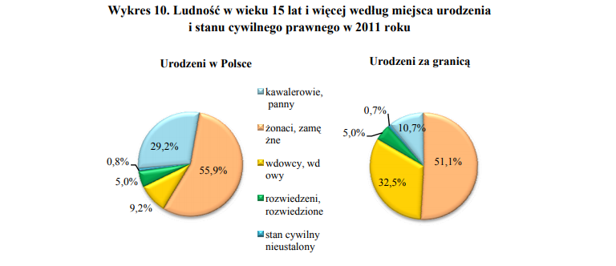

```{r setup, include=FALSE}
knitr::opts_chunk$set(echo = TRUE)
```




Zdecydowałem się połączyć dwa wykresy kołowe w jeden słupkowy

```{r message=FALSE, warning=FALSE}
library(ggplot2)
library(dplyr)
data = read.csv('dane.csv', header = T)

ordering <- data %>% filter(miejsce_urodzenia == 'Polska') %>% arrange(desc(procent)) %>% pull(stan_cywilny)
dogde = 0.9

ggplot(data, aes(x = stan_cywilny, y = procent, fill = miejsce_urodzenia)) + 
 geom_bar(stat = 'identity', position = position_dodge(width = dogde)) +
  geom_text(aes(label = procent), position = position_dodge(width = dogde)) +
  scale_x_discrete(limits = ordering) +
  ylab('%') + 
  xlab('Stan cywilny') + 
  guides(fill=guide_legend(title="Miejsce urodzenia")) + 
  ggtitle('Ludność w wieku 15 lat i więcej według miejsca urodzenia \n i stanu cywilnego  w 2011 roku')

```
