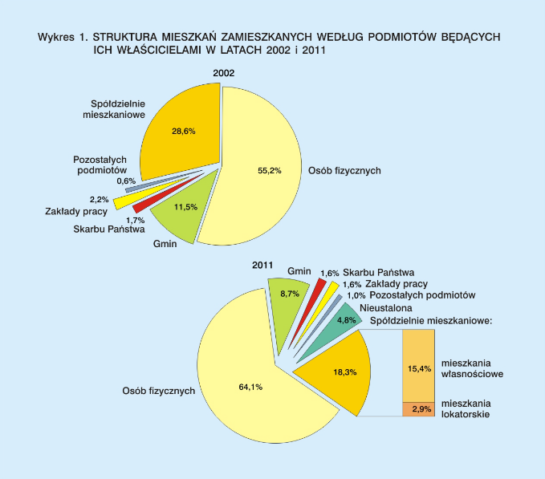

```{r setup, include=FALSE}
knitr::opts_chunk$set(echo = TRUE)
```

```{r,message=FALSE,warning=FALSE,error=FALSE}
library(dplyr)

mieszkania_2002 <- c("Osoba fizyczna", "Spółdzielnia mieszkaniowa", "Gmina", "Zakład pracy", "Skarb Państwa", "Pozostałe podmioty")

proc_2002 <- c(55.2, 28.6, 11.5, 2.2, 1.7, 0.6)

df_2002 <- data.frame(owner=mieszkania_2002, percent=proc_2002, year=2002)

mieszkania_2011 <- c("Osoba fizyczna", "Spółdzielnia mieszkaniowa", "Gmina", "Nieustalona", "Zakład pracy", "Skarb Państwa", "Pozostałe podmioty")

proc_2011 <- c(64.1, 18.3, 8.7, 4.8, 1.6, 1.6, 1.0)

df_2011 <- data.frame(owner=mieszkania_2011, percent=proc_2011, year=2011)

df <- bind_rows(df_2002, df_2011)
```


Zmiany:
* Przerobienie wykresów kołowych na skumulowane wykresy słupkowe
* Przedstawienie wykresów słupkowych obok siebie
* Ujednolicenie rozdziału sþółdzielni mieszkaniowych w 2011 r.

```{r,message=FALSE,warning=FALSE,error=FALSE}
library(ggplot2)

mutate(df) %>% 
  ggplot(aes(x = factor(year), y = percent, fill=owner)) +
  geom_bar(stat='identity') + 
  ggtitle("Struktura mieszkań zamieszkanych według podmiotów będących ich właścicielami w latach 2002 i 2011") +
  xlab("Rok") + 
  ylab("Procent")

```
