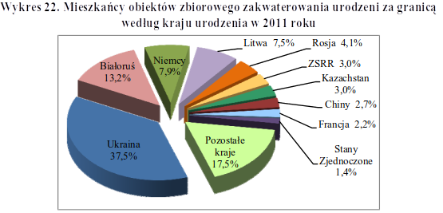

```{r setup, include=FALSE}
knitr::opts_chunk$set(echo = TRUE)

library(dplyr)
library(ggplot2)
library(scales)
```

# GUS



# Poprawiony

* Zmiana geometri -- porównywanie kontów vs długości
* Zmiana kolorów -- nie lubie MS
* Usunięcie efektu 3D -- czytelność
* Posortowanie -- szybkie porównanie

```{r wykres, echo=FALSE}
categories = c("Białoruś", "Niemcy", "Litwa", "Rosja", "ZSRR",
               "Kazachstan", "Chiny", "Francja", "Stany Zjednoczone",
               "Pozostałe", "Ukraina")
values = c(13.2, 7.9, 7.5, 4.1, 3.0, 3.0, 2.7, 2.2, 1.4, 17.5, 37.5) / 100

plot.title = "Mieszkańcy obiektów zbiorowego zakwaterowania\nurodzeni za granicą według kraju urodzenia w 2011 roku"

data.frame(categories, values) %>% 
  ggplot(aes(x = reorder(categories, values), y = values, fill = categories)) +
  geom_col() + 
  expand_limits(y = max(values) * 1.1) + 
  geom_text(aes(label = scales::percent(values)), hjust = -0.1) +
  scale_y_continuous(labels = scales::percent) +
  coord_flip() +
  ggtitle(plot.title) +
  ylab("Procentowe pochodzenie mieszkańców z zagranicy") + 
  xlab(element_blank()) + 
  theme(legend.position = "none")
```
