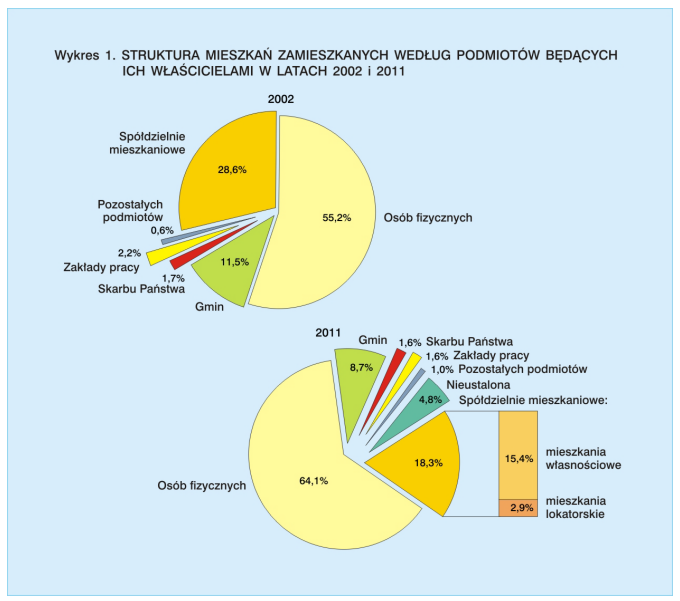

```{r setup, include=FALSE}
knitr::opts_chunk$set(echo = TRUE)
```

## Wykres oryginalny

zródło: 


## Wprowadzone modyfikacje
1) dane pokazane na jednym wykresie

2) użyłem barplot - aby łatwiej było porównywać wartości pomiedzy latami (lata obok siebie)

3) sortowanie nierosnące

4) zastosowane kolory wydają się bardziej atrakcyjne


```{r, echo=FALSE, message=FALSE}

library(ggplot2)
library(tidyverse)

# dane
podmiot <- c("Osób fizycznych","Osób fizycznych", "Spółdzielnie mieszkaniowe", "Spółdzielnie mieszkaniowe", "Gmin", "Gmin", "Skarbu Państwa", "Skarbu Państwa", "Zakłady Pracy", "Zakłady Pracy", "Pozostałych Podmiotów", "Pozostałych Podmiotów", "Nieustalona", "Nieustalona")
rok <- c("2011", "2002", "2011", "2002", "2011", "2002", "2011", "2002", "2011", "2002", "2011", "2002", "2011", "2002")
wartosc <- c(64.1, 55.2, 18.3, 28.6, 8.7, 11.5, 1.6, 1.7, 1.6, 2.2, 1.0, 0.6, 4.0, 0.0)


df<- data.frame(podmiot, rok, wartosc)


ggplot(data = df, aes(x = reorder(podmiot, wartosc), y = wartosc, fill = rok)) + 
  geom_bar(stat = 'identity', position = "dodge") +
  geom_text(aes(label = paste0(wartosc), hjust = -0.2), position = position_dodge(width = 0.9)) +
  scale_x_discrete() +
  scale_y_continuous(limits = c(0, max(wartosc) +  10), breaks = seq(0, max(wartosc) +  10, by = 10)) + 
  ggtitle("Struktura mieszkań zamieszkanych według podmiotów \r\nbędących ich właścicielami w latach 2002 i 2011") +
  xlab('Właściciel') +
  ylab('Procent będących właścicielami')  +
  scale_fill_brewer(palette="Dark2") +
  coord_flip()

```

