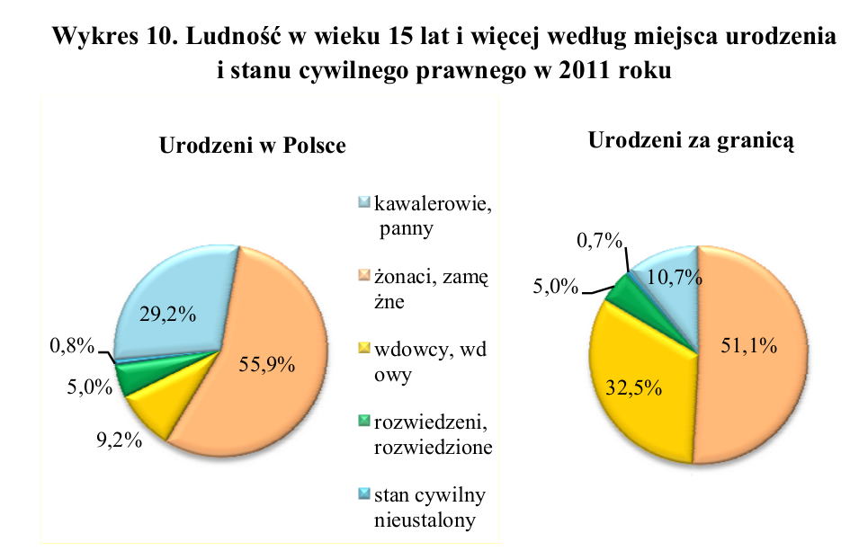

```{r setup, include=FALSE}
knitr::opts_chunk$set(echo = TRUE, fig.align="center")
```


# Wykres oryginalny

Poniższym wykres ma dwie części kołowe -- lepiej przedstawić te dane na wykresie słupkowym. Ponadto przy wykresie słupkowym za pomocą dwóch kolorów można pokazać zestawienie danych z dwóch podwykresów, to jest urodzonych w Polsce i urodzonych za granicą.

Na dodatek kolory dwóch kategorii są do siebie zbliżone, więc ciężko określić o której kategorii mowa (w szczególności, że nie widać jednej z tych kategorii, bo jej wartości są zbyt małe).



# Wersja poprawiona

```{r, include = FALSE, message = FALSE}
library('ggplot2')
library('dplyr')
library('RColorBrewer')

kategorie <- c("kawaler/panny", "żonaty/zamężna", "wdowiec/wdowa", "rozwiedzony/rozwiedzona", "stan cywilny nieustalony")
urodzeni_polska    <- c(29.2, 55.9,  9.2, 5.0, 0.8)
urodzeni_zagranica <- c(10.7, 51.1, 32.5, 5.0, 0.7)
```

## Dane
```{r}
dane <- data.frame(
    kategorie  = rep(kategorie, 2),
    wartość    = c(urodzeni_polska, urodzeni_zagranica),
    urodzony_w = c(rep("Polska", 5), rep("Zagranica", 5))
)

kategorie_wedlug_sumy <- dane %>%
    group_by(kategorie) %>%
    summarise(suma_w_kategorii = sum(wartość)) %>%
    arrange(-suma_w_kategorii) %>%
    pull(kategorie)
```

## Wykres
```{r}
ggplot(dane, aes(x = kategorie, y = wartość, fill = urodzony_w)) +
    # Geometria
    geom_bar(stat = "identity", position = "dodge") +
    
    # Skale i 
    scale_x_discrete(limits = kategorie_wedlug_sumy) +
    scale_y_continuous(limits = c(0, 100), expand = c(0, 0)) +
    theme_classic() +
    
    # Opisy osi i legendy
    labs(x = "", y = "Liczba osób w danym stanie cywilnym [%]", fill = "Miejsce urodzenia") +
    theme(axis.text.x = element_text(angle = 45, hjust = 1))
```
