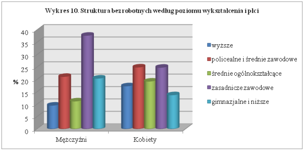

```{r setup, include=FALSE}
knitr::opts_chunk$set(echo = TRUE)
```

## Oryginalna wizualizacja



Na wykresie łatwo zauważyć podstawowe błędy:
* zbędna głębia wykresu
* nie potrzebny trzeci wymiar słupków
* nie widać dokładnej wysokości słupków
* ciężko porównać wartości między płciami dla danego wykształcenia

Na początku wczytajmy dane.
```{r}
male_percentages <- c(5.4, 9.5, 13.5, 12.9, 22.7)
female_percentages <- c(6.5, 12.1, 16.2, 16.4, 23.0)
percentages <- c(male_percentages, female_percentages)
genders <- c()
genders[0:5] <- 'Mężczyźni'
genders[6:10] <- 'Kobiety'
genders <- as.factor(genders)
educations <- c('wyższe', 'policealne i średnie zawodowe', 'średnie ogólnokształcące', 'zasadnicze zawodowe', 'gimnazjalne i niższe')
educations <- c(educations, educations)
educations <- as.factor(educations)

my_data <- data.frame(percentages, genders, educations)
```

Przedstawmy wszystko na jednym wykresie aby łatwiej zauważyć relacje między płciami i usuńmy zbędne dodatki takie jak dodatkowe kolory, głębia i trzeci wymiar.

```{r,message=FALSE,warning=FALSE,error=FALSE}
library(dplyr)
library(ggplot2)
library('stringr')

ggplot(my_data, aes(x = educations, y = percentages, fill = genders)) +
  geom_col(position = position_dodge(width = 1)) +
  geom_text(label = paste0(percentages, '%'), vjust = -1, position = position_dodge(width = 1)) +
  scale_x_discrete(name = '', labels = function(x) str_wrap(x, width = 10)) +
  scale_y_continuous(name = '', limits = c(0, 25), labels = function(x) paste0(x, '%')) +
  scale_fill_discrete(name = 'Płeć') +
  ggtitle('Struktura bezrobotnych według poziomu wykształcenia i płci')
```

